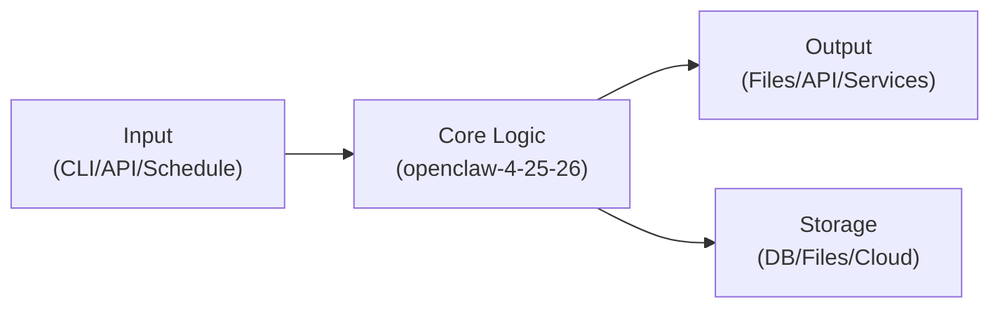
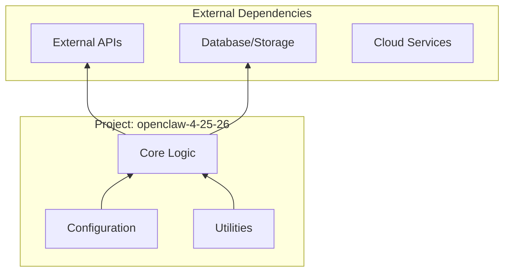
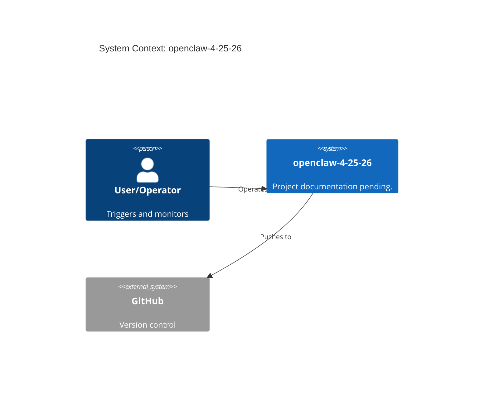

# Architecture Graph: openclaw-4-25-26

> Visual architecture documentation — 2026-05-23

## Component Hierarchy

```mermaid
graph TD
    subgraph "openclaw-4-25-26"
    _agents[".agents"]
    _audit_2026_05_11[".audit-2026-05-11"]
    _cinematic_pilot_edits[".cinematic-pilot-edits"]
    _claude[".claude"]
    _github[".github"]
    _pi[".pi"]
    _test_audit_openclaw[".test_audit_openclaw"]
    _vscode[".vscode"]    end
```

## Data Flow



## Dependency Graph



## System Context



---

*Generated by TAG AI Blueprint Agent — 2026-05-23*
