# TAG AI / OpenClaw State-City Repo Map

Audit date: 2026-06-30
Repo branch observed: `docs/ecosystem-map-2026-06-11`
Purpose: explain the repo like a city, show what makes money, show the risk, and list the GitHub documentation work that should follow.

## 0. Ground Rules Used For This Review

I did not assume the stack from memory. I checked the repo, the local TAG docs, the live health endpoints, and current official documentation for the main providers and frameworks listed below.

I did not change application code. This document is a map and action plan only.

Important live checks on 2026-06-30:

- `https://julian.ubntag.com/healthz` returned `200` with `{"ok":true,"status":"live"}`.
- `https://openclaw.ubntag.com/healthz` returned `200` with `{"ok":true,"status":"live"}`.
- `pnpm.cmd docs:list` did not complete because pnpm reported a lockfile/config mismatch. That is a repo health issue, not proof that docs are missing.

## 1. Visual Repo Map

```mermaid
flowchart TD
  State["STATE: TAG AI business ecosystem"]

  CityA["CITY: OpenClaw / Jarvis tenant platform"]
  CityB["CITY: Hetzner deploy and safety layer"]
  CityC["CITY: Revenue factories"]
  CityD["CITY: Provider and tool marketplace"]
  CityE["CITY: Docs, rules, and governance"]

  State --> CityA
  State --> CityB
  State --> CityC
  State --> CityD
  State --> CityE

  CityA --> A1["STREET: src/ core runtime"]
  CityA --> A2["STREET: ui/ and apps/ user surfaces"]
  CityA --> A3["STREET: packages/ shared libraries"]
  CityA --> A4["STREET: extensions/ plugins"]
  CityA --> A5["STREET: mcp-servers/ external tool bridges"]

  CityB --> B1["STREET: _tagai/bootstrap/ tenant setup"]
  CityB --> B2["STREET: _tagai/business-box/deploy/ paid launch gates"]
  CityB --> B3["STREET: Caddy + Docker + health checks"]
  CityB --> B4["STREET: backups and recovery docs"]

  CityC --> C1["STREET: _tagai/business-box/ sales machine"]
  CityC --> C2["STREET: rescue-websites-sim/ website rescue pipeline"]
  CityC --> C3["STREET: Michelle CMA and voice AI services"]
  CityC --> C4["STREET: outbound email, calendar, and phone flows"]

  CityD --> D1["STREET: AI model providers"]
  CityD --> D2["STREET: email, phone, and voice providers"]
  CityD --> D3["STREET: database, cloud, search, and scraping providers"]
  CityD --> D4["STREET: GitHub and deployment providers"]

  CityE --> E1["STREET: AGENTS.md rules"]
  CityE --> E2["STREET: docs/ product docs"]
  CityE --> E3["STREET: _tagai/audit-* risk records"]
  CityE --> E4["STREET: changelog and release controls"]
```



## 2. State

The state is the full TAG AI business ecosystem.

Plain English: this is the whole territory. It includes the AI assistants, websites, lead engines, voice systems, deployment server, safety rules, and documentation that turn technical work into revenue.

Business goal: build repeatable AI systems that can sell, serve customers, automate operations, and launch paid tenants faster.

## 3. Cities

### City 1: OpenClaw / Jarvis Tenant Platform

This is the main city. It runs assistants for different tenants like Gus and Julian.

Outcomes:

- Run AI assistants.
- Connect assistants to tools.
- Route chat, voice, email, data, and code workflows.
- Let each tenant have its own gateway, token, and workspace.

Revenue purpose:

- Makes custom AI assistants sellable as paid systems.
- Reduces manual work by letting assistants use tools.
- Creates a reusable platform instead of one-off projects.

### City 2: Hetzner Deploy And Safety Layer

This is the city power grid, water system, roads, and emergency services.

Outcomes:

- Hosts the live systems.
- Routes domains through Caddy.
- Runs containers with Docker Compose.
- Checks health endpoints.
- Holds backup and tenant setup scripts.

Revenue purpose:

- Keeps paid customer systems online.
- Reduces deployment time.
- Prevents avoidable downtime and manual recovery work.

### City 3: Revenue Factories

These are the business shops in the city. They turn the platform into money.

Outcomes:

- Generate rescue website leads.
- Support outreach campaigns.
- Prepare prospect lists.
- Run CMA and real estate workflows.
- Support voice AI and appointment workflows.

Revenue purpose:

- Creates leads.
- Closes service deals faster.
- Turns repeatable playbooks into packages that can be sold.

### City 4: Provider And Tool Marketplace

This is the equipment warehouse. It contains the outside services the city depends on.

Outcomes:

- AI models answer and reason.
- Email providers send messages.
- Voice providers handle calls.
- Databases store customer and workflow data.
- Search and scraping providers find leads and website data.

Revenue purpose:

- Gives the assistants real-world abilities.
- Lets one assistant research, write, send, call, schedule, and report.

### City 5: Docs, Rules, And Governance

This is city hall. It tells builders what is allowed, what is risky, and how to ship safely.

Outcomes:

- Records architecture.
- Records risks.
- Defines coding and deployment rules.
- Explains setup, tests, and release gates.

Revenue purpose:

- Reduces chaos.
- Helps new work ship faster.
- Prevents accidental damage to customer systems.

## 4. Streets, Houses, And Rooms

| City | Street | Houses | Rooms | Plain-English meaning |
| --- | --- | --- | --- | --- |
| OpenClaw / Jarvis | `src/` | Core runtime, channels, gateway, plugin loader, protocol | TypeScript files, schemas, gateway protocol, channel code | The engine room. It decides how messages, tools, plugins, and gateways work. |
| OpenClaw / Jarvis | `extensions/` | Provider and channel plugins | plugin manifests, `src/` code, tests, config files | Tool shops that plug into the city. Firecrawl, Telegram, and other plugins live here. |
| OpenClaw / Jarvis | `packages/` | Shared libraries | package source files and package configs | Shared building materials used by multiple parts of the system. |
| OpenClaw / Jarvis | `ui/` | Control surfaces | React/UI components, screens, config panels | The dashboards and buttons humans use. |
| OpenClaw / Jarvis | `apps/` | Platform apps | mobile, desktop, or companion app folders | The front doors for different devices and users. |
| Provider marketplace | `mcp-servers/` | External tool bridges | Microsoft Graph server, tool handlers, auth setup | Translators that let assistants talk to outside services. |
| Revenue factories | `_tagai/business-box/` | Paid tenant launch system | guardrails, intake docs, preflight scripts, deployment checks | The business packaging line for turning the platform into customer offers. |
| Revenue factories | `rescue-websites-sim/` | Julian website rescue simulator | simulator README, migrations, tests | A workshop for finding broken business websites and turning them into outreach opportunities. |
| Deploy and safety | `_tagai/bootstrap/` | Tenant bootstrapper | shell scripts, tenant config templates, Caddy setup | The machine that creates a new tenant city block. |
| Deploy and safety | `_tagai/audit-*` | Risk and recovery records | risk register, technical architecture, remaining work | The inspection reports. They show what is fixed, what is open, and what can fail. |
| Docs and governance | `docs/` | Product and operator documentation | setup guides, provider docs, configuration references | The public instruction manuals. |
| Docs and governance | `AGENTS.md` | Repo rules | commands, architecture rules, test rules, release rules | The city building code. It tells engineers how not to break the city. |

## 5. Houses And Rooms With Revenue Meaning

### House: Tenant Gateway

Rooms:

- Tenant gateway config.
- Gateway token.
- Per-tenant ports.
- Health endpoint.
- Provider credentials.

What it does: gives each customer or operator their own assistant entrance.

Revenue purpose: makes it possible to sell one system per customer without mixing all customers into one unsafe bucket.

### House: Plugin System

Rooms:

- Plugin manifest.
- Plugin config.
- Tool handlers.
- Tests.
- Documentation.

What it does: lets the city add new equipment without rebuilding the whole city.

Revenue purpose: faster new offers. If a customer needs email, scraping, phone, or calendar, the system can add the right plugin.

### House: MCP Servers

Rooms:

- Microsoft Graph tools.
- GitHub tools.
- Supabase tools.
- Vercel tools.
- Custom TAG AI functions.

What it does: gives assistants controlled access to outside systems.

Revenue purpose: turns an assistant from a chatbot into a worker that can search mail, send mail, schedule work, update code, and fetch business data.

### House: Business Box

Rooms:

- Paid tenant guardrails.
- Prospect intake.
- Preflight deploy checks.
- Architecture rules.

What it does: packages the platform into paid customer launches.

Revenue purpose: makes sales and delivery repeatable instead of custom every time.

### House: Rescue Websites

Rooms:

- Website scan logic.
- Provider validation docs.
- Migration records.
- Outreach plan.

What it does: finds local businesses with weak or broken websites.

Revenue purpose: creates a lead list for website rescue offers and AI service upsells.

### House: Michelle CMA / Voice AI

Rooms:

- CMA service.
- Voice AI domain.
- Real estate reports.
- Call and appointment tooling.

What it does: supports real estate workflows and voice customer service.

Revenue purpose: creates higher-value service packages for real estate and appointment-heavy businesses.

## 6. Agents And Workers

| Agent or worker | Where it lives | What it does | Revenue purpose | Current concern |
| --- | --- | --- | --- | --- |
| Gus gateway | Hetzner tenant runtime | Runs Gus assistant gateway | Main operator assistant and internal command center | Shared providers must stay isolated from Julian. |
| Julian gateway | Hetzner tenant runtime | Runs Julian assistant gateway | Supports Julian’s business workflows and rescue websites | Needs stronger identity and outbound sending separation. |
| OpenClaw core agent loop | `src/` | Routes messages to models and tools | The main assistant brain | Must stay plugin-agnostic. |
| Telegram channel worker | `extensions/telegram/` and channel code | Connects chat messages to the assistant | Lets operators use assistants from Telegram | Token and tenant isolation must stay clean. |
| Microsoft Graph MCP worker | `mcp-servers/microsoft-graph/` | Reads/sends mail, lists calendar events, works with Drive | Automates admin and sales operations | Julian currently appears to use shared Gus identity. |
| Supabase MCP/tooling | tenant MCP config and provider tools | Reads and writes operational data | Stores lead, tenant, and workflow state | Shared tokens need rotation and tighter scope. |
| Vercel MCP/tooling | tenant MCP config | Manages deployment-related work | Speeds website and app shipping | Needs tenant-level permission clarity. |
| GitHub MCP/tooling | tenant MCP config | Works with repos, issues, and PRs | Speeds engineering delivery | Two live PATs were recorded as exposed in chat history and need rotation. |
| Firecrawl plugin worker | `extensions/firecrawl/` | Scrapes and maps websites | Feeds lead research and rescue website scans | Local branch shows active Firecrawl changes that need clean review. |
| Business Box preflight | `_tagai/business-box/deploy/` | Checks DNS, Docker, Caddy, backups, allowlists | Prevents failed paid launches | Must become a required paid launch gate. |
| Tenant bootstrapper | `_tagai/bootstrap/` | Creates tenant folders, ports, config, Caddy block | Speeds new customer setup | Prints sensitive token material and needs careful handling. |
| Health monitors | deploy scripts and endpoints | Proves services are alive | Reduces downtime and support load | Health is green now, but restore proof still matters. |
| Backup and restore jobs | `_tagai` ops docs/scripts | Protects tenant data | Prevents business loss after server failure | Restore drill is still a high-priority open risk. |
| Rescue Websites simulator | `rescue-websites-sim/` | Tests tenant isolation and lead pipeline assumptions | Finds website rescue revenue | Provider drift can break scans or produce bad lead data. |
| Hermes skill bundle | `_tagai` design docs | Planned packaged agent skill system | Could speed tenant onboarding | It is designed, but not verified as live critical path. |
| Michelle CMA service | TAG ecosystem deploy layer | Generates comparative market reports | Real estate revenue support | Must be kept separate from unrelated OpenClaw changes. |
| Maya / voice AI | TAG voice stack | Handles voice assistant flows | Phone leads, appointments, service automation | Voice provider contracts need current validation before changes. |

## 7. Tools Being Used

### Core development equipment

- Node.js and TypeScript: the main coding language and runtime.
- pnpm workspaces: the package manager and monorepo wiring.
- Vitest: test runner.
- Playwright: browser/app testing where needed.
- Docker Compose: local and server container orchestration.
- Caddy: public HTTPS routing and reverse proxy.
- GitHub and GitHub Actions: source control and CI.

### AI model equipment

- Anthropic Claude.
- OpenAI.
- Google Gemini.
- DeepSeek.
- Groq.
- Mistral.
- Minimax.

### Voice and communication equipment

- Telegram Bot API.
- Microsoft Graph.
- Resend.
- Telnyx.
- VAPI.
- LiveKit.
- Deepgram.
- Cartesia.
- Twilio placeholder.

### Data, search, and scraping equipment

- Supabase.
- Vercel.
- Cloudflare.
- Hetzner.
- Tavily.
- Exa.
- Apify.
- Apollo.
- Browserbase.
- Firecrawl.
- Google Places.

### Media and business equipment

- Kie.ai.
- Suno.
- SimplyRETS.
- Michelle CMA service.
- Langfuse.
- OpenWeather.

## 8. Outcomes And Objectives

| Area | Outcome | Objective |
| --- | --- | --- |
| OpenClaw core | Stable assistant runtime | Let one platform power many assistants. |
| Plugins | Add new abilities quickly | Turn provider integrations into reusable products. |
| MCP servers | Controlled outside-system access | Let assistants do real work, not just answer questions. |
| Tenant gateway | Separate tenant entrances | Sell systems to multiple customers without mixing data. |
| Business Box | Paid launch checklist | Make paid tenant launches repeatable. |
| Rescue Websites | Lead engine | Find businesses that need website and AI help. |
| Michelle CMA | Real estate reports | Sell higher-value real estate automation. |
| Voice AI | Phone and appointment handling | Capture leads that would otherwise be missed. |
| Docs and audits | Shared memory | Keep engineering, ops, and business strategy aligned. |

## 9. Revenue Purpose By System Area

| System area | Revenue purpose |
| --- | --- |
| Tenant gateways | Package each customer as a paid assistant system. |
| Bootstrap scripts | Reduce time from sale to launch. |
| Provider plugins | Add customer-specific services faster. |
| Firecrawl and Places workflows | Find leads and qualify websites. |
| Resend and Graph email flows | Send outreach and follow-ups. |
| Telnyx, VAPI, LiveKit, Deepgram | Handle calls, voice agents, and appointment capture. |
| Supabase | Store leads, customer state, and workflow history. |
| GitHub and Vercel tooling | Ship website fixes and demos faster. |
| Business Box guardrails | Prevent a paid launch from breaking due to missing basics. |
| Risk register | Focus engineering time on failures that would cost money. |

## 10. Risk And Gaps

| Priority | Risk | Why it matters | Next move |
| --- | --- | --- | --- |
| Critical | Exposed GitHub PATs and shared Supabase token are recorded in repo docs as needing rotation | A leaked token can let someone read, write, or destroy systems | Rotate immediately, update tenants, verify old tokens fail. |
| Critical | Restore proof is not complete enough for paid tenants | Backups do not matter until restore is proven | Run a real restore drill and document recovery time. |
| High | Device auto-approve is not paid-tenant safe | A tenant system should not approve unknown devices blindly | Replace with explicit approval, audit trail, and tenant allowlist. |
| High | Microsoft Graph identity appears shared | Julian acting as Gus can confuse ownership, audit logs, and customer trust | Give Julian his own app registration, mailbox, and permissions. |
| High | Outbound email identity is shared too broadly | Cold outreach can damage the main domain reputation | Move outreach to a separated sending domain or subdomain. |
| High | Provider drift exists in Firecrawl, Google Places, and Gemini Live notes | APIs change; old calls fail or return different data | Update each integration against official docs before code changes. |
| Medium | Current branch has mixed dirty work | Committing all would blend docs, Firecrawl code, env samples, deleted files, and untracked audits | Commit this map separately, then split remaining work into focused PRs. |
| Medium | `pnpm docs:list` is blocked by lockfile/config mismatch | The documented first step cannot run cleanly | Fix pnpm config/lockfile alignment in its own change. |
| Medium | Stale backup and env files are noted in TAG docs | Old files can contain secrets or wrong setup instructions | Inventory, redact, archive, or delete after reading each file. |
| Medium | Hermes is designed but not verified as a live critical path | Planning docs can look real before runtime proof exists | Mark design-only until tested. |

## 11. Documentation Validation Report

| Provider or framework | Official documentation checked | Repo areas that depend on it | Validation result |
| --- | --- | --- | --- |
| Caddy | `https://caddyserver.com/docs/automatic-https`, `https://caddyserver.com/docs/caddyfile/directives/reverse_proxy` | `_tagai/`, Caddy deploy blocks, tenant domains | Caddy is the right public HTTPS and reverse proxy layer. Keep using official Caddyfile behavior. |
| Docker Compose | `https://docs.docker.com/reference/cli/docker/compose/`, `https://docs.docker.com/compose/environment-variables/` | `_tagai/bootstrap/`, deploy docs, containers | Compose remains the correct container runner. Env handling must be kept explicit. |
| pnpm | `https://pnpm.io/workspaces`, `https://pnpm.io/settings` | repo install, docs list, workspace scripts | Current local `docs:list` failure suggests package manager config drift that needs repair. |
| Node.js | `https://nodejs.org/api/` | runtime scripts, MCP servers, OpenClaw core | Repo requires Node 22 per local rules. Keep runtime validation tied to actual installed version. |
| TypeScript | `https://www.typescriptlang.org/docs/` | `src/`, `extensions/`, `packages/`, MCP servers | Strict TypeScript is the correct safety layer. Avoid `any` and loose boundaries. |
| Vitest | `https://vitest.dev/guide/` | test lanes and colocated tests | Continue using repo `pnpm test` lanes, not raw vitest. |
| Playwright | `https://playwright.dev/docs/intro` | app/browser verification | Use for UI and browser proof when frontend behavior changes. |
| Telegram Bot API | `https://core.telegram.org/bots/api` | Telegram plugin/channel | Bot behavior and token use must match current Bot API docs. |
| Microsoft Graph | `https://learn.microsoft.com/en-us/graph/api/user-sendmail`, `https://learn.microsoft.com/en-us/graph/api/user-list-messages`, `https://learn.microsoft.com/en-us/graph/api/calendar-list-calendarview`, `https://learn.microsoft.com/en-us/entra/identity-platform/v2-oauth2-client-creds-grant-flow` | `mcp-servers/microsoft-graph/`, tenant MCP configs | Graph app-only permissions need tenant-specific review before production use. |
| Model Context Protocol TypeScript SDK | `https://github.com/modelcontextprotocol/typescript-sdk` | `mcp-servers/` and MCP tool bridges | MCP server shape should stay aligned with the TypeScript SDK. |
| Supabase | `https://supabase.com/docs/guides/api/api-keys`, `https://supabase.com/docs/guides/database/postgres/row-level-security` | tenant configs, data workflows, MCP tooling | Key scope and row-level security matter for paid tenant isolation. |
| Resend | `https://resend.com/docs/api-reference/emails/send-email`, `https://resend.com/docs/dashboard/domains/introduction` | outbound email workflows | Sending domains and verified identities must be separated for outreach safety. |
| Firecrawl | `https://docs.firecrawl.dev/sdks/node`, `https://docs.firecrawl.dev/api-reference/introduction` | `extensions/firecrawl/`, rescue website scans | Local notes show v1/v2 drift risk. Re-check SDK calls before merging Firecrawl work. |
| Google Places | `https://developers.google.com/maps/documentation/places/web-service/choose-api`, `https://developers.google.com/maps/documentation/places/web-service/migrate-overview` | rescue website lead enrichment | Legacy/new Places API mix is a real risk. Pick one supported path and document it. |
| Google Gemini | `https://ai.google.dev/gemini-api/docs/api-key`, `https://ai.google.dev/gemini-api/docs/live` | AI providers, Live API experiments | Live API model names and key restrictions must be validated before changes. |
| OpenAI | `https://platform.openai.com/docs/` | AI provider config and agent runtime | Use official model and API docs before provider changes. |
| Anthropic | `https://docs.anthropic.com/en/docs/about-claude/models/overview` | AI provider config and agent runtime | Validate current model IDs before edits or deployments. |
| DeepSeek | `https://api-docs.deepseek.com/` | AI provider config | Validate model names and auth behavior from official docs before changes. |
| Vercel | `https://vercel.com/docs/cli`, `https://vercel.com/docs/domains/working-with-domains` | Vercel MCP/tooling and site deployment | Check CLI version before deploy, per repo rules. |
| LiveKit | `https://docs.livekit.io/agents/`, `https://docs.livekit.io/sip/` | voice AI and SIP workflows | Current voice changes should be checked against Agents and SIP docs. |
| Telnyx | `https://developers.telnyx.com/docs/voice/sip-trunking` | voice and telephony workflows | SIP and voice flows need provider-specific validation before launch. |
| VAPI | `https://docs.vapi.ai/` | Maya / voice assistant flows | Validate assistant, phone, and webhook behavior before changing production voice flows. |
| GitHub | `https://docs.github.com/en/authentication/keeping-your-account-and-data-secure/managing-your-personal-access-tokens`, `https://docs.github.com/actions` | repo, CI, MCP tooling, PATs | Token rotation and least privilege are urgent. |
| Hetzner Cloud | `https://docs.hetzner.cloud/` | VPS and deploy layer | Keep server work tied to real hcloud and server state, not assumptions. |
| Cloudflare | `https://developers.cloudflare.com/` | DNS, docs, possible worker/browser tooling | Validate DNS and product-specific behavior before Cloudflare changes. |

## 12. Recommended Action Plan

1. Rotate secrets first.
   - Rotate the exposed GitHub PATs.
   - Rotate the shared Supabase token.
   - Verify old tokens fail.
   - Update tenant configs without committing secrets.

2. Keep this map as a separate GitHub commit.
   - Do not commit unrelated dirty files with it.
   - Push the branch so the map is visible for review.

3. Split current dirty work into focused lanes.
   - Lane A: ecosystem docs.
   - Lane B: Firecrawl plugin code and tests.
   - Lane C: env sample cleanup.
   - Lane D: Julian rescue website audit docs.
   - Lane E: deleted webhook-handler decision.

4. Fix the documentation command blocker.
   - Repair pnpm config/lockfile mismatch.
   - Re-run `pnpm.cmd docs:list`.
   - Document why it broke.

5. Run a paid-tenant restore drill.
   - Prove a backup can restore.
   - Record steps, timing, and failure points.
   - Make it a launch gate.

6. Replace paid-tenant device auto-approve.
   - Require explicit approval.
   - Add tenant allowlist and audit log.
   - Fail closed for unknown devices.

7. Separate Julian identity.
   - Separate Microsoft Graph mailbox/app registration.
   - Separate outbound email sending identity.
   - Separate cold outreach domain or subdomain.

8. Validate and repair provider drift.
   - Firecrawl SDK/API.
   - Google Places API path.
   - Gemini Live model IDs.
   - VAPI, LiveKit, Telnyx voice contracts.

9. Update operational docs after each fix.
   - Update `_tagai/ECOSYSTEM.md`.
   - Update risk register.
   - Update paid-tenant launch checklist.
   - Update deployment and rollback docs.

## 13. GitHub Documentation Update Plan

Commit now:

- `_tagai/STATE_CITY_REPO_MAP_2026-06-30.md`

Prepare next, in separate PRs:

- `_tagai/ECOSYSTEM.md`: make this the canonical live ecosystem map after reviewing current dirty edits.
- `_tagai/README.md`: add a short entry pointing to the state-city map.
- `_tagai/audit-2026-05-27/RISK_REGISTER.md`: update risk status after token rotation, restore drill, and Graph isolation.
- `_tagai/business-box/ARCHITECTURE_GUARDRAILS.md`: add restore proof and identity separation as paid-tenant launch gates.
- `_tagai/business-box/deploy/preflight-paid-tenant.sh`: fail paid launch when backup restore proof or identity separation is missing.
- `_tagai/bootstrap/bootstrap-tenant.sh`: stop printing sensitive token material in normal output.
- `docs/gateway/configuration-reference.md`: update only after reading `docs/AGENTS.md` and confirming public docs should mention the behavior.
- `docs/tools/firecrawl.md`: update only with the Firecrawl code PR after SDK behavior is verified.
- `_tagai/julian-rescue-websites-audit-2026-06-08/`: decide whether this should be committed here, pushed to Julian’s repo, or copied to VPS docs.

## 14. Suggested README Content Ready To Commit Later

```md
## TAG AI Ecosystem Map

The TAG AI ecosystem is documented as a state-city map in `_tagai/STATE_CITY_REPO_MAP_2026-06-30.md`.

Use that map when you need to understand:

- which systems are live,
- which folders belong to which business function,
- which agents and workers exist,
- which providers are used,
- what each part does for revenue,
- which risks should be fixed first.

Before changing provider code, deployment scripts, authentication, voice, email, database, or tenant setup, re-check the latest official provider documentation and record what was validated.
```

## 15. Bottom Line

The repo is not just an app. It is a business city.

- The state is TAG AI.
- The main city is OpenClaw / Jarvis.
- The streets are the repo folders.
- The houses are gateways, plugins, tools, docs, and revenue systems.
- The rooms are files, configs, prompts, scripts, tests, and environment variables.
- The agents are the workers inside those rooms.
- The tools are outside providers like Supabase, GitHub, Microsoft Graph, Caddy, Docker, Firecrawl, Gemini, Resend, Telnyx, VAPI, and LiveKit.

The fastest path to revenue is not adding more features first. It is making the current paid-tenant path safe, repeatable, documented, and recoverable.
