# TAG AI / OpenClaw State-City Repo Map And Vercel Upgrade Plan

Audit date: 2026-07-02
Branch observed: `docs/ecosystem-map-2026-06-11`
Purpose: refresh the repo city map, validate current provider docs, install the requested content skill, and convert the latest Vercel platform research into a practical upgrade plan.

## 0. What Was Actually Verified

I did not assume this repo was a Next.js or Vercel app. I checked the repo first.

Confirmed locally:

- This repo is primarily the OpenClaw gateway/plugin monorepo, not a standard Next.js site.
- No `vercel.json`, `vercel.ts`, or `next.config.*` file was found by targeted search.
- `Vercel CLI 54.18.1` is installed.
- The Vercel account token can list active TAG projects.
- Vercel account projects include several adjacent deploy targets such as `ai-for-real-estate-live`, `rescue-websites-by-tag-ai`, `rescue-websites-tag-ai`, `spectrum-command-center`, `salesedge-ai`, and `michelle-sanchez-realtor`.
- The requested skill `viral-instagram-reels` was installed locally under `.agents/skills/viral-instagram-reels/`.
- Local `.agents` skill installs were kept out of git with `.git/info/exclude`.

Blocked or degraded checks:

- `pnpm.cmd docs:list` initially failed because `@whiskeysockets/baileys@7.0.0-rc.9` pulled an exotic git `libsignal` subdependency while `blockExoticSubdeps` was enabled. Follow-up validation resolved this by moving pnpm settings into `pnpm-workspace.yaml` and upgrading Baileys to `7.0.0-rc13`, which uses npm `libsignal@6.0.0`.
- Context7 MCP was requested by the repo-audit skill, but no Context7 tool was available in this session. I used official provider documentation by web instead.

## 1. Visual Repo Map

```mermaid
flowchart TD
  State["STATE: TAG AI business machine"]

  CityA["CITY: OpenClaw / Jarvis gateway"]
  CityB["CITY: Tenant launch and Hetzner operations"]
  CityC["CITY: Revenue factories"]
  CityD["CITY: Provider equipment yard"]
  CityE["CITY: Vercel project neighborhood"]
  CityF["CITY: Docs, rules, and safety office"]

  State --> CityA
  State --> CityB
  State --> CityC
  State --> CityD
  State --> CityE
  State --> CityF

  CityA --> A1["STREET: src/ gateway, protocol, agents"]
  CityA --> A2["STREET: extensions/ plugins"]
  CityA --> A3["STREET: packages/ shared libraries"]
  CityA --> A4["STREET: ui/ control UI"]
  CityA --> A5["STREET: apps/ desktop and mobile clients"]

  CityB --> B1["STREET: _tagai/bootstrap/ tenant factory"]
  CityB --> B2["STREET: _tagai/business-box/deploy/ paid launch gates"]
  CityB --> B3["STREET: Docker + Caddy + health checks"]

  CityC --> C1["STREET: rescue-websites-sim/ lead engine"]
  CityC --> C2["STREET: _tagai/rescue-patch-2026-05-12/ live rescue app patch"]
  CityC --> C3["STREET: _tagai/business-box/ vertical offers"]
  CityC --> C4["STREET: Michelle CMA / voice / real estate flows"]

  CityD --> D1["STREET: Supabase, Microsoft Graph, Resend"]
  CityD --> D2["STREET: Firecrawl, Google Places, Gemini"]
  CityD --> D3["STREET: OpenAI, Anthropic, DeepSeek"]
  CityD --> D4["STREET: Telnyx, VAPI, LiveKit, Deepgram"]

  CityE --> E1["STREET: Vercel MCP provider in tenant template"]
  CityE --> E2["STREET: adjacent Vercel Next.js projects"]
  CityE --> E3["STREET: Vercel AI Gateway model surface"]
  CityE --> E4["STREET: future Queues, Workflows, Sandbox, Rolling Releases"]

  CityF --> F1["STREET: AGENTS.md rules"]
  CityF --> F2["STREET: _tagai/audit-* reports"]
  CityF --> F3["STREET: docs/ public docs"]
  CityF --> F4["STREET: changelog and release gates"]
```

Plain English:

- The state is the full TAG AI business.
- The cities are the big systems.
- The streets are repo folders and provider lanes.
- The houses are features, apps, dashboards, agents, and services.
- The rooms are files, configs, scripts, prompts, tests, and environment variables.
- The workers are agents, scripts, cron jobs, MCP servers, and background jobs.
- The utilities are outside tools like Vercel, Supabase, GitHub, Caddy, Docker, Firecrawl, Microsoft Graph, Resend, and AI model providers.

## 2. City Breakdown

| City | What it does | Main streets | Revenue purpose |
| --- | --- | --- | --- |
| OpenClaw / Jarvis gateway | Runs the assistant brain and plugin system | `src/`, `extensions/`, `packages/`, `ui/`, `apps/` | Sell and operate reusable AI assistants instead of rebuilding one-off bots. |
| Tenant launch and Hetzner operations | Creates and runs tenant gateways | `_tagai/bootstrap/`, `_tagai/business-box/deploy/`, Caddy, Docker | Reduces time from sold deal to live tenant. |
| Revenue factories | Turns tools into offers and leads | `rescue-websites-sim/`, `_tagai/rescue-patch-2026-05-12/`, `_tagai/business-box/` | Finds prospects, sends outreach, produces reports, and supports paid service packages. |
| Provider equipment yard | Connects assistants to real-world systems | MCP servers, provider configs, plugin manifests | Lets assistants research, email, call, deploy, store data, and report outcomes. |
| Vercel project neighborhood | Hosts adjacent TAG web products and gives OpenClaw deployment tools | Vercel MCP, account projects, future Vercel platform features | Faster websites, safer rollouts, better AI routing, lower ops load. |
| Docs and safety office | Keeps the city understandable and governable | `AGENTS.md`, `_tagai/audit-*`, `docs/`, changelog | Prevents repeated mistakes and shortens onboarding. |

## 3. Agents And Workers

| Worker | Where it lives | What it does | Business outcome |
| --- | --- | --- | --- |
| OpenClaw gateway | `src/` and live tenant containers | Routes messages, agents, models, and tools | Core AI assistant platform. |
| Plugin workers | `extensions/` | Add channels and provider tools | Faster customer-specific integrations. |
| Microsoft Graph MCP | `mcp-servers/microsoft-graph/` | Mail, calendar, and file operations | Sales/admin automation. |
| Supabase MCP/tooling | tenant MCP configs and live project | Stores leads, workflow state, and rescue pipeline data | Durable revenue data. |
| Vercel MCP | `_tagai/bootstrap/_template/openclaw.json.tpl` | Gives tenants access to Vercel project operations | Faster site deploy and investigation workflows. |
| Rescue website pipeline | `_tagai/rescue-patch-2026-05-12/` and `rescue-websites-sim/` | Finds, audits, and follows up with weak websites | Lead generation engine. |
| Paid tenant preflight | `_tagai/business-box/deploy/preflight-paid-tenant.sh` | Checks whether a tenant is ready to launch | Prevents paid launch failures. |
| Backup/sync scripts | `_tagai/scripts/` | Protects tenant state off-server | Reduces disaster recovery risk. |
| Viral Instagram Reels skill | `.agents/skills/viral-instagram-reels/` local only | Helps plan and diagnose Instagram Reels | Content distribution for offers, demos, and lead magnets. |

## 4. Tools And Providers Validated

| Provider / tool | Official docs checked on 2026-07-02 | Where it matters in repo | Action |
| --- | --- | --- | --- |
| Vercel Fluid Compute | `https://vercel.com/docs/fluid-compute` | Adjacent TAG apps and future OpenClaw functions | Use for API/AI workloads on Vercel instead of old edge-first assumptions. |
| Vercel `vercel.ts` | `https://vercel.com/docs/project-configuration/vercel-ts` | Adjacent Vercel deploy repos | Adopt in site repos that actually deploy to Vercel. Do not add blindly to this gateway repo. |
| Vercel AI Gateway | `https://vercel.com/docs/ai-gateway` | OpenClaw model routing and Swift tests referencing `vercel-ai-gateway` | Make AI Gateway the preferred multi-model control plane for TAG web apps and future OpenClaw provider work. |
| Vercel Queues | `https://vercel.com/docs/queues` | Outreach, reporting, background tasks | Candidate for website rescue jobs and async email/report workflows in Vercel-hosted projects. |
| Vercel Workflows | `https://vercel.com/docs/workflows` | Multi-step lead pipelines | Candidate for durable lead audit -> report -> send sequences. |
| Vercel Sandbox | `https://vercel.com/docs/sandbox` | Agent code execution and browser tools | Candidate for safer hosted execution, not a direct replacement for local gateway sandbox today. |
| Vercel Rolling Releases | `https://vercel.com/docs/rolling-releases` | Adjacent production web apps | Use canary rollouts for revenue pages before full public launch. |
| Vercel Agent and MCP | `https://vercel.com/docs/agent`, `https://vercel.com/docs/mcp` | Production investigation and deploy automation | Good match for TAG project operations, especially with Vercel-hosted sites. |
| Skills ecosystem | `https://www.skills.sh/` | `.agents/skills/` local agent abilities | Skills are agent operating manuals, not product runtime code. Keep local unless intentionally productized. |
| Supabase | `https://supabase.com/changelog.md`, RLS docs | rescue website data and MCP | Keep using advisors. Do not fake tenant RLS with client-supplied tenant IDs. |
| GitHub PATs | GitHub PAT docs | repo, CI, MCP, Git operations | Tokens pasted into chat should be treated as exposed and rotated. |
| Docker Compose | Docker Compose docs | local and server containers | Keep Compose as runtime packaging for OpenClaw gateway. |
| Caddy | Caddy automatic HTTPS docs | Hetzner public HTTPS routing | Good fit for live tenant domains. |
| Firecrawl | Firecrawl Node SDK docs | `extensions/firecrawl/`, rescue website scanning | Finish current dirty Firecrawl work in its own PR. |
| Microsoft Graph | Microsoft Graph sendMail docs | MCP mail/calendar bridge | Separate tenant identity before customer use. |
| Google Places / Gemini Live | Google official docs | rescue enrichment and voice/AI features | Places legacy/new API drift and Gemini Live token model need a dedicated fix pass. |
| OpenAI | OpenAI official API docs | model/media providers | Validate model IDs before provider config changes. |
| Resend | Resend send email docs | outreach email | Separate cold-outreach domain reputation from main domain. |
| LiveKit | LiveKit Agents docs | voice AI | Validate voice flow before production changes. |

## 5. Vercel Biggest Advancements And What They Mean Here

### Fluid Compute

Vercel is no longer just "static frontend hosting." Fluid Compute is closer to a flexible city power plant. It can run longer backend and AI jobs with better cold-start behavior and shared function instances.

Best use here:

- Put TAG customer-facing Next.js apps on Fluid Compute.
- Use it for API routes that call models, generate reports, or coordinate webhooks.
- Do not migrate the OpenClaw gateway container itself to Vercel until the runtime shape is proven.

### `vercel.ts`

`vercel.ts` is now the typed project configuration path. It is useful when a repo is actually deployed by Vercel.

Best use here:

- Add `vercel.ts` to the adjacent Vercel site repos, not this gateway repo.
- Use it to standardize headers, redirects, crons, rewrites, and rollout settings.

### AI Gateway

AI Gateway is the best fit for TAG because this business uses many models. Think of it as one toll booth for all model roads.

Best use here:

- Route web-app AI calls through AI Gateway for observability, fallback, and cost control.
- Keep OpenClaw provider plugins generic and contract-first.
- Avoid hardcoding one model provider into customer-facing apps.

### Queues And Workflows

Queues are the conveyor belts. Workflows are the foreman who remembers the whole job.

Best use here:

- Queue website scan jobs.
- Run report generation after scan completion.
- Schedule delayed follow-up emails.
- Retry failed tasks without losing the lead.

### Sandbox

Sandbox is a safer workbench for code execution.

Best use here:

- Evaluate for agent tasks that execute generated code.
- Keep current local/Docker sandbox until a proof-of-concept proves parity.

### Rolling Releases

Rolling Releases are a slow opening of the city gates.

Best use here:

- Use for high-revenue pages and funnels.
- Roll out changes to a slice of traffic before full exposure.

### Vercel Agent And MCP

These are Vercel-side workers that can investigate deployments and operate projects.

Best use here:

- Use Vercel MCP in tenant assistant configs.
- Use Vercel Agent for production deploy investigation where the app is on Vercel.

## 6. Vercel Upgrade Plan, Designed For This Repo

This repo should not be blindly converted into a Vercel app. The correct upgrade is a two-layer plan:

### Layer 1: OpenClaw repo upgrades

1. Keep OpenClaw as the gateway/plugin monorepo.
2. Keep Docker/Caddy/Hetzner for tenant gateway runtime until Vercel can prove container/runtime parity for this workload.
3. Strengthen the Vercel MCP tenant template.
4. Add docs that explain when a TAG project belongs on Vercel and when it belongs on Hetzner.
5. Add a provider contract for `vercel-ai-gateway` model routing rather than scattering direct provider assumptions.
6. Move long-running lead pipeline steps toward queue/workflow contracts, with Vercel Queues as the target for Vercel-hosted lead sites.

### Layer 2: Adjacent Vercel app upgrades

1. Add `vercel.ts` to each actual Vercel site repo.
2. Enable Fluid Compute for AI/API-heavy apps.
3. Use Rolling Releases for funnels and customer-facing pages.
4. Use AI Gateway for model calls.
5. Use Queues or Workflows for scan/report/email flows.
6. Add BotID or bot management where forms attract junk traffic.
7. Add Vercel MCP/Agent investigation playbooks.

## 7. Revenue Flow Map

```mermaid
flowchart LR
  Traffic["Traffic: search, social, outreach, referrals"]
  Capture["Lead capture: forms, calls, DMs, email replies"]
  Research["AI research: Firecrawl, Places, Supabase, Graph"]
  Offer["Offer: rescue website, CMA, voice AI, business automation"]
  Delivery["Delivery: Vercel sites + OpenClaw agents + tenant tools"]
  Followup["Follow-up: Resend, Graph, voice, CRM"]
  Revenue["Revenue: paid setup, monthly retainer, upsells"]

  Traffic --> Capture
  Capture --> Research
  Research --> Offer
  Offer --> Delivery
  Delivery --> Followup
  Followup --> Revenue
  Revenue --> Followup
```

Biggest revenue bottleneck:

- The lead machines exist, but the deployment and follow-up lanes are split across this repo, adjacent Vercel projects, Supabase, and external provider accounts.

Highest-leverage fix:

- Turn the rescue website flow into a durable queue/workflow pipeline: scan -> audit -> report -> outreach -> follow-up -> CRM handoff.

## 8. Risks And Gaps

| Risk | Severity | Why it matters | Fix |
| --- | --- | --- | --- |
| Tokens pasted in chat | Critical | Chat text should be treated as exposed | Rotate Vercel, Supabase, and GitHub tokens after this work window. |
| Repo is dirty with unrelated work | High | A broad commit could mix docs, Firecrawl code, env changes, deleted files, and audits | Commit only scoped docs/code changes. |
| `pnpm docs:list` package-manager blocker | Resolved | The required repo doc discovery command could not run until Baileys/libsignal and pnpm settings were fixed | Keep `blockExoticSubdeps` enabled and monitor future dependency changes. |
| Vercel apps live outside this repo | High | A full Vercel upgrade cannot be proven from this repo alone | Audit each actual Vercel project repo separately. |
| This repo has Vercel provider configs but no Vercel app config | Medium | Adding `vercel.ts` here would be decorative, not useful | Add `vercel.ts` only to deployable Vercel app repos. |
| Supabase RLS remains project-wide work | High | Tenant data can leak if policies are permissive or fake | Continue advisors and tenant-claim design. |
| Firecrawl work is dirty and unmerged | Medium | Rescue scans can drift from SDK docs | Split into a dedicated Firecrawl PR. |
| Microsoft Graph shared identity | High | Tenant actions can appear under the wrong mailbox | Separate app registrations and mailboxes. |

## 9. GitHub Update Plan

Committed now or next in this branch:

- `_tagai/STATE_CITY_REPO_MAP_2026-07-02.md`

Do not mix into this commit:

- Existing dirty `CHANGELOG.md`.
- Existing dirty `_tagai/ECOSYSTEM.md`.
- Existing dirty Firecrawl files.
- Existing deleted `_tagai/webhook-handler.mjs`.
- Local `.agents/skills/*` installs.

Next GitHub PRs:

1. Vercel operating playbook for adjacent TAG apps.
2. Firecrawl SDK v2 cleanup.
3. Supabase advisor cleanup and RLS design.
4. Vercel AI Gateway provider-contract plan for OpenClaw.
5. Package manager policy follow-through: keep `pnpm docs:list` and WhatsApp tests green after future dependency upgrades.

## 10. Plain-English Bottom Line

This repo is the operations city. Vercel is not the city hall here. Vercel is the neighborhood where many customer-facing storefronts live.

The right move is not to force this whole repo into Vercel. The right move is:

- keep OpenClaw as the gateway city,
- use Vercel for the storefronts,
- use Vercel AI Gateway as the model toll booth,
- use Queues and Workflows as the conveyor belts,
- use Rolling Releases as the safe rollout gate,
- use Vercel MCP and Agent as the production investigation crew.

That gives TAG AI faster launches, safer customer pages, better AI cost control, and a cleaner road from lead to revenue.
