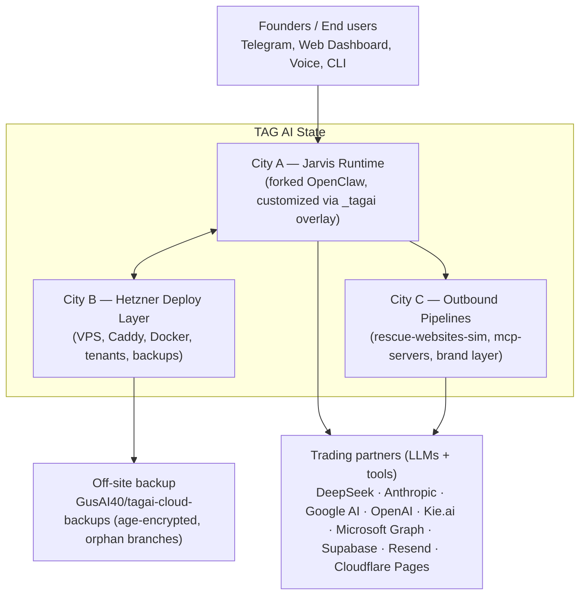
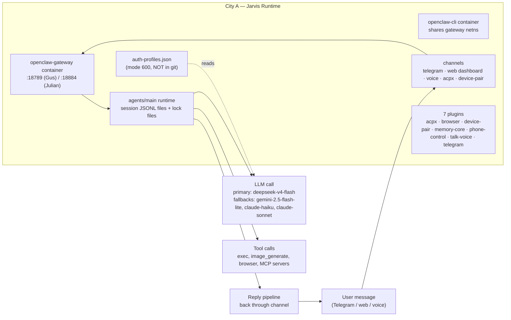
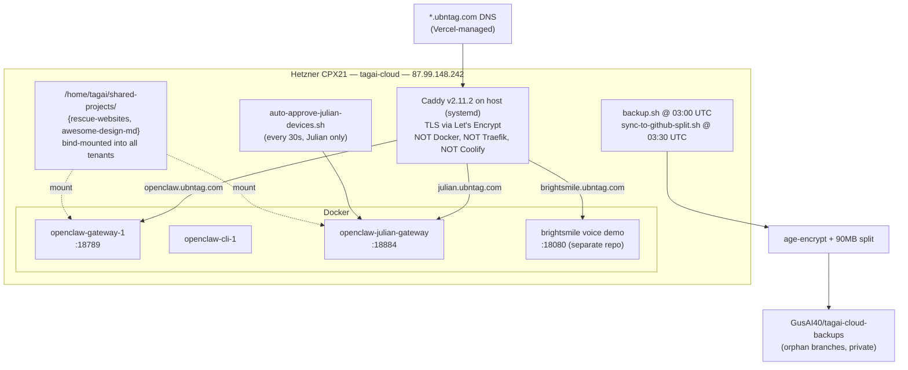
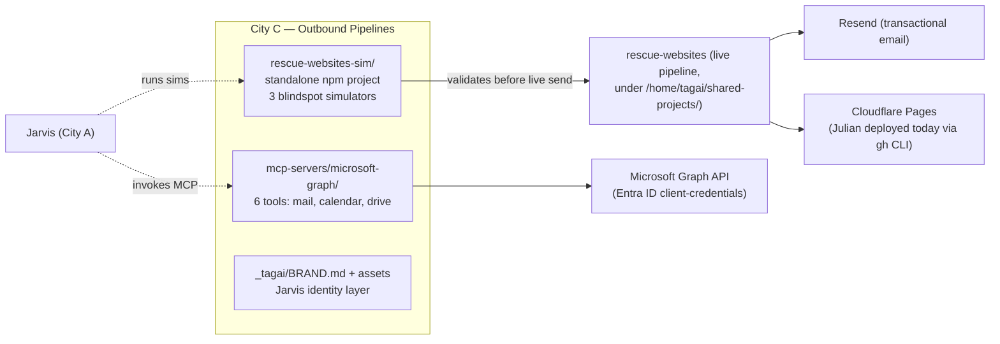

# TAG / OpenClaw — Visual Repo Map

**Audit date:** 2026-05-27
**Scope:** TAG-owned layers only. Upstream OpenClaw (`src/`, `extensions/`, `packages/`, `ui/`, `apps/`) is out of scope — that's openclaw/openclaw's job, not TAG's.

---

## Plain-English Frame

Think of this repo as a **state** (TAG AI). Inside the state, three **cities** make or protect money. Each city has **streets** (modules), **houses** (services), **rooms** (configs), and **workers** (agents/crons). Outside the state, **trading partners** (providers like DeepSeek, Anthropic, Kie.ai, Telegram) send goods in and money out.

If a city's lights go out, a specific revenue stream stops. We'll name each one.

---

## State map (top level)

---

## City A — Jarvis Runtime (the brain)

**Workers in this city:**
- **Telegram poller** — long-polls Telegram every few seconds, hands messages to gateway
- **Heartbeat cron** — runs every 30m (Gus) / 12h (Julian) per `openclaw.json:agents.defaults.heartbeat`
- **Health monitor** — interval 300s, restarts unhealthy components

---

## City B — Hetzner Deploy Layer (the building)

---

## City C — Outbound Pipelines (the trucks leaving the state)

---

## Cross-city wires (where money flows or breaks)

| Wire | Direction | What flows | Failure cost |
|---|---|---|---|
| Caddy → Gus gateway | inbound | Founder's own Jarvis traffic | Personal productivity stops (no revenue, but blocks every other workstream) |
| Caddy → Julian gateway | inbound | Julian's first paid-customer-like tenant | Tenant unusable. Today's incident was here. |
| Gateway → DeepSeek | outbound | All primary LLM calls | Falls back to Gemini → Anthropic chain |
| Gateway → Anthropic | outbound | Fallback LLM | **Broken for Gus main** (dotted model IDs) |
| Gateway → Telegram | outbound | Replies to founders | Lane jam = silent loss (just happened to Julian) |
| Hetzner → GitHub backups | nightly | Encrypted state snapshots | Without age key in 1Password, backup is unrecoverable |
| Shared bind-mounts | host → tenant | rescue-websites runtime + design assets | If symlinks used instead of bind-mounts, breaks silently |

---

## What's intentionally NOT mapped here

- Upstream OpenClaw `src/`, `extensions/`, `packages/`, `ui/`, `apps/`, `docs/` — not TAG-owned, not pushed by TAG.
- TAG-AI Vercel website (`ubntag.com` itself, including `/maps/*`, `/erate`, `/industries/*`) — separate repo `TAG_ai`, has its own vercel-routing rule in `~/.claude/rules/`.
- Voice demo (`voice-agent-demo`) — separate repo, runs on the same Hetzner box as `brightsmile.ubntag.com:18080`.
- Spectrum / Michelle / E-Rate / VoiceAI pipelines — separate TAG project repos.

See `TECHNICAL_ARCHITECTURE.md` for city writeups and worker tables.
