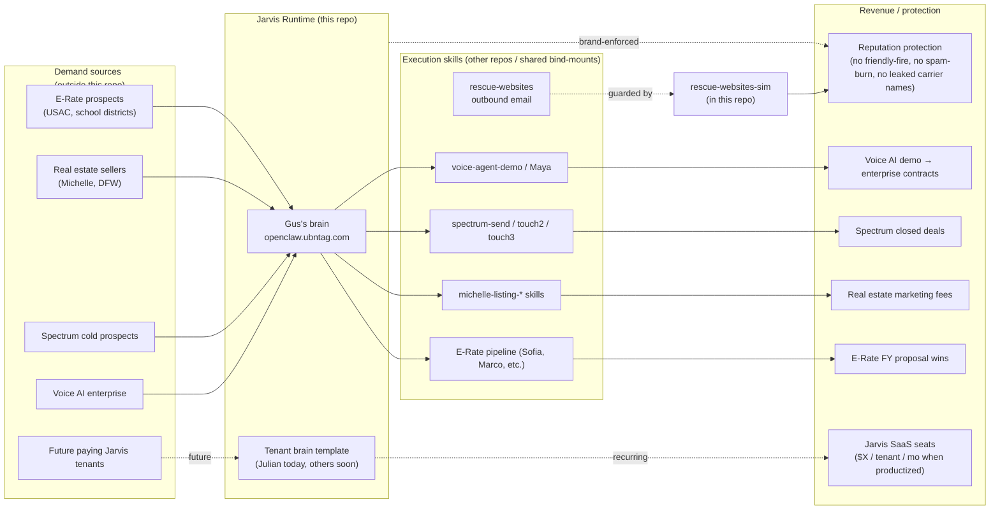

# Revenue Flow Map — TAG / OpenClaw

**Audit date:** 2026-05-27
**Companion:** `REPO_VISUAL_MAP.md`, `RISK_REGISTER.md`.

This doc answers one question: **how does this codebase make or protect money, and where are the leaks?**

---

## The honest framing

This repo (the OpenClaw fork) is **not the revenue surface** — it's the **execution layer** for revenue that's earned elsewhere. The actual money comes from:

1. **E-Rate proposals** (TAG E-Rate Support → schools/libraries via USAC) — handled in separate projects (Spectrum, Spectrum-Touch2/3, copper-send pipelines, etc.).
2. **Real estate marketing** (Michelle Sanchez at Coldwell Banker Global Luxury) — separate Michelle-CBR-* projects.
3. **Outbound prospecting / sales automation** — Spectrum Enterprise outreach, rescue-websites pipeline, Apollo workflows. Different repos.
4. **Voice AI demos to enterprise** — `voice-agent-demo` and Maya, separate repos.

This repo's job is to **be the brain that runs those workstreams without dropping the ball.** It also positions TAG to **sell Jarvis as a per-tenant service** to outside customers (Julian is the proof-of-concept).

So "revenue flow" here means:
- (A) How does this brain make Gus's other revenue workstreams faster / better / safer?
- (B) How does the per-tenant pattern position TAG to charge for Jarvis itself?

---

## Flow diagram

---

## Where money currently flows

| Path | Revenue today | This repo's role |
|---|---|---|
| Gus types into Telegram or web dashboard → Jarvis invokes a skill → E-Rate / Michelle / Spectrum work gets shipped | Indirect — Gus's other workstreams. | Jarvis runtime in City A. If down, all the other workstreams slow down because Gus does each task manually. |
| Julian (proof-of-concept tenant) uses his own Jarvis to build the rescue-websites cleanup pipeline | $0 today — Julian is internal. But this is the **template** for future paying tenants. | Tenant isolation, bootstrap script, shared bind-mounts. |
| `rescue-websites-sim` flags bugs before a live send | Reputation-protection. No direct $, but a 1000-email blast on `ubntag.com` would damage every TAG transactional email pipeline. | Sim lives in this repo; live pipeline lives in `/home/tagai/shared-projects/`. |
| MCP microsoft-graph lets Jarvis read/send mail on behalf of the founder | Indirect — closes the loop on email workflows that otherwise need human babysitting. | Single MCP server in `mcp-servers/`. |

---

## Where revenue is leaking (highest-leverage findings)

### Leak #1 — Gus's Jarvis fails silently when DeepSeek is throttled

**What happens.** Gus main `openclaw.json` has dotted Claude model IDs that Anthropic rejects. If DeepSeek throttles or runs out of credits, Gemini key is expired today, so fallback chain dies at the third hop with `claude-haiku-4.5 → 400 invalid model`. Gus's Jarvis goes dark. **Every workstream Gus uses Jarvis for slows down.**

**Highest-leverage fix.** Two-line `sed` on `openclaw.json` + container restart. See Risk R-1. Estimated time: **5 minutes**. Estimated value: keeps the brain alive when LLM costs spike or credits dip.

### Leak #2 — Heartbeat / long-running tool calls jam the lane

**What happens.** Today (2026-05-27, Julian's tenant) and 2026-05-22 (also Julian) — same family of bug. A long tool chain (Veo video gen + Cloudflare deploy + GitHub push) holds `agent:main:main` for hours. New Telegram messages queue behind it and never get answered. Tenant looks healthy from the outside; users get silence.

**Highest-leverage fix.** Add a runtime watchdog: if `[diagnostic] stuck session` fires twice in 10 minutes for the same `sessionKey`, auto-quarantine the session and free the lane. Today's manual fix takes ~10 minutes; an automated version takes seconds and prevents the next outage. See Risk R-2.

### Leak #3 — Per-tenant productization isn't ready

**What happens.** TAG has the technical mechanism to spin up tenants (`bootstrap-tenant.sh`), but the auto-approve-julian-devices.sh script disables device-pair security for Julian only. Until that's replaced with a real auth signal per tenant, **paid Jarvis SaaS cannot ship.** Today's leak is "$0/mo from Jarvis" because the product isn't safe to sell yet.

**Highest-leverage fix.** Replace the auto-approve cron with a one-time device-pair email/SMS challenge per new device (gateway already has the device-pair plugin loaded). When that's in place, the per-tenant pattern can charge $X/mo per seat. See Risk R-7.

### Leak #4 — Live pipeline still has the 3 bugs the sim documented

**What happens.** `rescue-websites-sim` was built specifically to catch friendly fire, hard-vs-soft unsub, and reputation burn. It works. **But the live pipeline still has all three structural issues** because `migrations/001-add-tenant-isolation.sql` is marked "PROPOSAL — DO NOT APPLY UNTIL SIMULATOR VALIDATES" and nobody has run the validation pass that authorizes the migration.

**Highest-leverage fix.** Run `npm run sim:full` once, confirm the three bugs surface, apply the migration to live Supabase, ship the fixes. See Risk R-9.

---

## Where revenue COULD flow (paths not yet built)

| Path | Blocker | What needs to ship |
|---|---|---|
| Paid Jarvis tenants ($X/mo per seat) | R-7 (device-pair single-factor in Julian's tenant) | Real auth challenge + billing wire (Stripe? Square? Internal invoice?) |
| Jarvis "executive assistant" tier built on MCP | R-10 (MCP not running on Julian) + Google Workspace MCP needed too | Bind-mount MCP into all tenants; document `setup-google-workspace` skill as the onboarding path |
| Sellable rescue-websites service | R-9 (live pipeline still has the 3 bugs) | Validate sim, apply migration, ship |
| Voice-as-a-channel for Jarvis (LiveKit/Telnyx) | Currently demo-only via `voice-agent-demo` | Promote it into Jarvis's channel list, not a separate repo |

---

## The single most leveraged action

**Fix Risk R-1 today (5 minutes).** It's the only change that costs almost nothing and immediately protects every revenue workstream Gus runs through Jarvis. Everything else is a bigger project.
