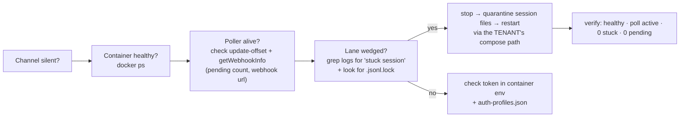
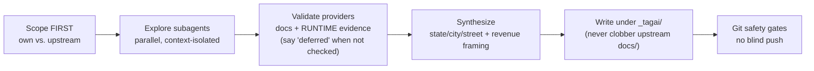
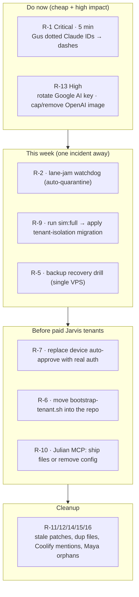
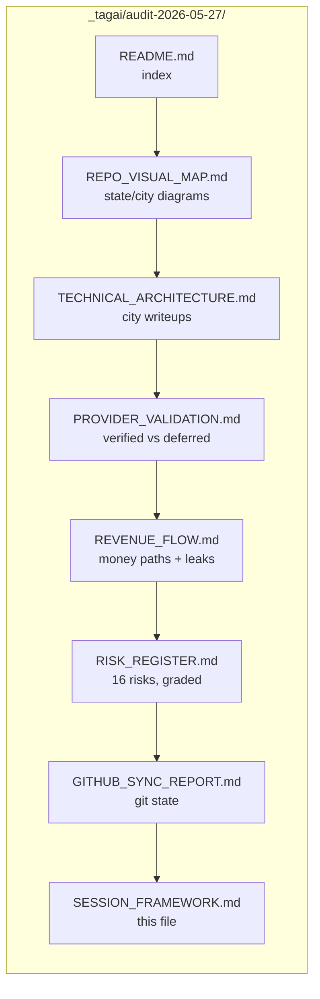

# Session Framework — 2026-05-27 → 28

A single visual of everything done this session: the Julian Telegram incident fix, then the full senior-engineer audit. Mermaid diagrams render natively on GitHub.

---

## 1. What happened, end to end

```mermaid
flowchart TD
    START["Session start<br/>Gus: who owns the two OpenClaw tenants?"]

    START --> T1["Tenant inventory<br/>Main = Gus · Julian = julian@ubntag.com<br/>(brightsmile = voice demo, not a tenant)"]

    T1 --> T2["Gus: Julian's Telegram is dead"]

    subgraph FIX["Incident fix (live on Hetzner)"]
        direction TB
        D1["Diagnose<br/>agent:main:main lane wedged since 14:08<br/>delivery-mirror replay loop"]
        D2["Root cause<br/>Julian uploaded a video → Veo + CF Pages + git push chain<br/>locked the lane → messages queued forever"]
        D3["Fix<br/>stop gateway · quarantine stuck session · restart"]
        D4["Verify<br/>healthy · telegram long-poll active · 0 stuck · 0 pending"]
        D1 --> D2 --> D3 --> D4
    end

    T2 --> FIX

    FIX --> A0["Gus: /audit-repo"]

    subgraph AUDIT["Senior-engineer audit"]
        direction TB
        S0["Scope decision<br/>TAG-owned only (not upstream)"]
        S1["Discover<br/>2 Explore subagents: _tagai/ + mcp/sim"]
        S2["Validate providers<br/>live docs + live runtime evidence"]
        S3["Synthesize<br/>maps · cities · revenue · risks"]
        S4["Write 6 docs<br/>under _tagai/audit-2026-05-27/"]
        S5["Git safety<br/>no push, 2 behind origin noted"]
        S0 --> S1 --> S2 --> S3 --> S4 --> S5
    end

    A0 --> AUDIT
    AUDIT --> END["This commit<br/>visual framework + push to GitHub"]
```

---

## 2. The two reusable playbooks this session produced

### Playbook A — "Tenant channel went silent" (the Julian pattern)

**Footguns proven this session:** don't `curl getUpdates` yourself while debugging (409 duplicate poller). Use the **tenant's own** compose file, not Gus's. Quarantine (move) the stuck session, don't delete it.

### Playbook B — "Audit a giant fork without boiling the ocean"

---

## 3. Risk priority — fix order

---

## 4. Deliverables map

---

## 5. One-line takeaways

- **The brain runs on one VPS.** Two tenants today (Gus + Julian). The pattern scales to paid seats once auth (R-7) is real.
- **The same lane-jam bug bit Julian twice in 6 days.** Manual fix works; automate it (R-2).
- **Gus's own Jarvis has a broken LLM safety net (R-1).** 5-minute fix, highest leverage in the repo.
- **The sim already found the live pipeline's 3 bugs (R-9).** The fix is written and waiting; only the validation pass is owed.
