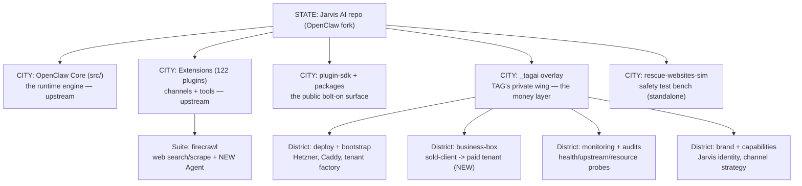

# Repo Visual Map — 2026-06-08

Plain-English picture of the whole machine, using the **State → City → Street → House → Room → Worker** analogy. The 05-27 map is still accurate for upstream core; this version adds the **business-box city** and the **Firecrawl Agent worker**.

---

## The State (the whole machine)

This repo is a **fork of OpenClaw** that TAG runs as **Jarvis AI**. Picture a big office building. Upstream OpenClaw built the building — the lobby, plumbing, 122 tenant suites (the `extensions/`). TAG rents the building and added one private wing, `_tagai/`, where all the money-specific work lives. The rule that keeps the lease clean: **don't remodel the building, only furnish your wing** — so upstream can keep renovating without fighting TAG's changes.

---

## City tour (what each part is for)

### City: OpenClaw Core (`src/`) — *upstream, don't remodel*
The engine room. Gateway (control plane), agent harness, channels (WhatsApp/Telegram/Slack/etc.), CLI + daemon. **Revenue role:** this is the brain stem. If it's down, every workstream Gus runs through Jarvis stalls. TAG treats it as a sealed engine — configure it, don't edit it.

### City: Extensions (`extensions/`, 122 suites) — *upstream*
One folder per channel/provider/tool. **Streets** = the tools each plugin registers. The suite that matters this month:

- **Suite `firecrawl`** — Jarvis's "go read the web" worker.
  - **Old workers:** `firecrawl_search`, `firecrawl_scrape`.
  - **NEW workers (uncommitted):** `firecrawl_agent`, `firecrawl_agent_status`, `firecrawl_agent_cancel` — a smarter agentic crawler (Firecrawl `spark-1` models). Validated real vs live docs. See PROVIDER_VALIDATION.

### City: `_tagai/` — *TAG's private wing, the money layer*
- **District: deploy + bootstrap** — `docker-compose.tagai.yml`, `bootstrap/` (tenant factory + teardown), Hetzner runbooks, Caddy audit. The plumbing that puts Jarvis on the internet.
- **District: business-box (NEW)** — the assembly line that turns a **sold client** into an **isolated paid tenant** with a vertical overlay (construction is the first vertical). Gated by `preflight-paid-tenant.sh`. This is the SaaS revenue road. See REVENUE_FLOW.
- **District: monitoring + audits** — weekly health/upstream/resource probes, plus the dated audit folders (`audit-2026-05-27/`, this one).
- **District: brand + capabilities** — Jarvis identity, channel strategy, capability inventory.

### City: `rescue-websites-sim/` — *standalone safety bench*
A pure-mock simulator (own npm project, not in the pnpm workspace) that catches outbound-email disasters (friendly fire, hard-vs-soft unsub, reputation burn) **before** they hit live Supabase. **Revenue role:** reputation protection — one bad blast on `ubntag.com` would hurt every TAG email pipeline.

---

## Workers (agents, scripts, crons) — what runs on its own

| Worker | Lives in | Job | Money/Safety role |
|---|---|---|---|
| Gateway agent (`agent:main:main`) | core runtime on Hetzner | Runs Gus's + tenants' Jarvis | The brain. R-7 jam history. |
| `lane-jam-watchdog.sh` | `_tagai/scripts/` (cron */3) | Frees a wedged agent lane | Stops silent message-drop (R-2, resolved) |
| `preflight-paid-tenant.sh` | `_tagai/business-box/deploy/` | Read-only launch gate for paid tenants | Safety belt for the SaaS product |
| `bootstrap-tenant.sh` | `_tagai/bootstrap/` | Provisions a new isolated tenant | The tenant factory |
| `backup.sh` | `_tagai/scripts/` (nightly) | age-encrypted off-site backup | Disaster recovery (R-4/R-5) |
| Monitor crons | `_tagai/monitoring/` | Weekly health/upstream/resource probes | Drift detection |
| `firecrawl_agent` (NEW) | `extensions/firecrawl/` | Agentic web data extraction | Powers vertical research; spend risk R-18 |

---

## Utilities (third-party providers this machine leans on)

LLM: DeepSeek (primary) → Gemini → Anthropic → OpenAI (fallback chain). Media: OpenAI `gpt-image-2`, Google Veo/Gemini image. Web: **Firecrawl** (search/scrape/agent). Infra: Hetzner CPX21 (single VPS), Caddy v2 on host (TLS), Docker Compose. DNS: **Vercel** (not Cloudflare — R-8). Channels: Telegram (live), WhatsApp/Slack (tiered). Backups: age-encrypted to a private GitHub branch.

> Full provider re-validation was last done 2026-05-27; only Firecrawl was re-checked 2026-06-08.
