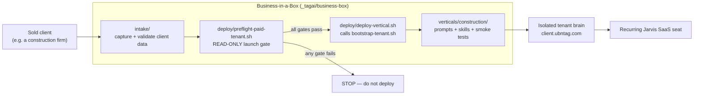

# Revenue Flow — Delta 2026-06-08

**Companion:** `_tagai/audit-2026-05-27/REVENUE_FLOW.md` (full map, still valid). This delta records the **one big move** since: the per-tenant SaaS path stopped being a "someday" and started being real code.

---

## The honest framing (unchanged)

This repo is the **brain that runs the money**, not the money itself. Revenue is earned in other workstreams (E-Rate, Michelle real estate, Spectrum outreach, voice AI). Jarvis's job is to run them faster, safer, and without dropping the ball. The *second* money road — **selling Jarvis itself, one tenant at a time** — is the one that changed this month.

---

## What changed: Business-in-a-Box went from idea to scaffold

The 05-27 audit said the per-tenant product "isn't ready" (Leak #3): the mechanism to spin up a tenant existed, but it wasn't *safe to sell*. Since then, `_tagai/business-box/` was built — the assembly line that turns **a sold client into an isolated, vertical-specific Jarvis tenant**.

**Why this is the highest-leverage thing in the repo right now:** it's the only path that turns engineering into **recurring revenue** instead of one-off task execution. Every other money road runs *through* Gus. This one can run *without* him, per paying customer.

### The launch gate is the product's safety belt

`preflight-paid-tenant.sh` is read-only and refuses nothing on its own — it just reports PASS/FAIL/WARN on the things that, if wrong, would burn a paying customer or TAG's reputation:

| Gate | Protects against | Prior risk it closes |
|---|---|---|
| Docker loopback-only ports | Exposing a tenant's gateway to the open internet | hardening |
| Backup exists + tar valid + sqlite integrity + age key present | Selling a seat you can't restore after a crash | R-4, R-5 (partial) |
| Telegram owner-id allowlist | A stranger talking to the tenant's Jarvis | channel security |
| **Warn on auto-approve device cron** | Single-factor device pairing on a paid box | **R-7** |
| DNS A-record present | Onboarding that silently 404s | R-8 |

This is real progress on Leak #3. **But read it precisely:** the gate *warns* about the device-pairing weakness (R-7); it does not *fix* it. The product is now **safe to demo and to gate**, but the moment a real per-device auth challenge ships (R-7), it becomes **safe to sell at scale**.

---

## Where the new revenue could leak

| Leak | What happens | Fix |
|---|---|---|
| **R-7 still open** | Can't safely auto-onboard paid tenants; each one needs a human eyeballing device pairing. Caps how many seats you can run. | Real per-device challenge (email/SMS OTP). Unblocks scale. |
| **Firecrawl Agent spend (R-18)** | A vertical's skill calls `firecrawl_agent` with no credit cap → 2,500-credit jobs drain the balance silently. Verticals lean on web research. | Conservative default cap. |
| **No restore drill (R-5)** | First real outage on a *paying* tenant is the worst time to discover the restore path is untested. | One drill to a throwaway VPS. |
| **Single shared sender domain** | Carried from R-9 family: verticals that send outbound on `ubntag.com` share deliverability with E-Rate/Spectrum. One bad construction-vertical blast hurts everything. | Per-tenant sender identity before any vertical sends mail. |

---

## The single most leveraged action (revenue lens)

**Ship the R-7 per-device auth challenge.** Everything else in business-box is built — intake, preflight, deploy, the construction vertical. R-7 is the one lock between "we can demo Jarvis-per-tenant" and "we can charge monthly for it without babysitting each box."
