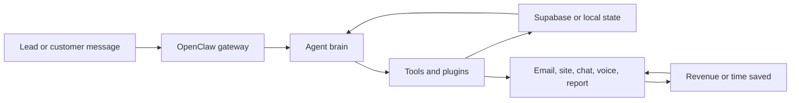

# Visual Repo Map - State, City, Street, House, Room

Audit date: 2026-07-02

## State

**State: TAG AI Operating System**

This is the whole business machine: AI assistants, lead engines, customer sites, tenant gateways, docs, scripts, and provider accounts.

```mermaid
flowchart TD
  State["State: TAG AI Operating System"]

  CityOpenClaw["City: OpenClaw Gateway"]
  CityTenantOps["City: Tenant Operations"]
  CityRevenue["City: Revenue Factories"]
  CityProviders["City: Provider Equipment Yard"]
  CityApps["City: Customer Apps"]
  CityDocs["City: Docs And Safety Office"]

  State --> CityOpenClaw
  State --> CityTenantOps
  State --> CityRevenue
  State --> CityProviders
  State --> CityApps
  State --> CityDocs

  CityOpenClaw --> Src["Street: src/"]
  CityOpenClaw --> Extensions["Street: extensions/"]
  CityOpenClaw --> Packages["Street: packages/"]
  CityOpenClaw --> UI["Street: ui/"]
  CityOpenClaw --> Apps["Street: apps/"]

  CityTenantOps --> Bootstrap["Street: _tagai/bootstrap/"]
  CityTenantOps --> Deploy["Street: _tagai/business-box/deploy/"]
  CityTenantOps --> Docker["Street: Docker, Caddy, Hetzner docs"]

  CityRevenue --> RescueSim["Street: rescue-websites-sim/"]
  CityRevenue --> RescuePatch["Street: _tagai/rescue-patch-2026-05-12/"]
  CityRevenue --> BusinessBox["Street: _tagai/business-box/"]
  CityRevenue --> Julian["Street: Julian rescue-websites recovery/audit"]

  CityProviders --> MCP["Street: mcp-servers/"]
  CityProviders --> ProviderPlugins["Street: provider plugins"]
  CityProviders --> Env["Street: env vars and tenant config"]

  CityApps --> Mobile["Street: apps/android, apps/ios, apps/shared"]
  CityApps --> ControlUI["Street: ui/ control dashboard"]
  CityApps --> VercelApps["Street: adjacent Vercel app repos"]

  CityDocs --> Agents["Street: AGENTS.md"]
  CityDocs --> AuditDocs["Street: _tagai/audit-*"]
  CityDocs --> PublicDocs["Street: docs/"]
```

## Tech Stack Pipeline

Plain-English version: traffic enters the city, the assistant researches it, the system creates an offer, the provider tools deliver it, and the follow-up loop turns it into revenue.

## City 1: OpenClaw Gateway

What it is: the city hall and traffic control center for AI assistants.

Streets:

- `src/` - core gateway, agents, channels, config, protocol, CLI, setup, safety, tools.
- `extensions/` - plugins for providers, channels, tools, media, models, and integrations.
- `packages/` - shared internal packages.
- `ui/` - Control UI dashboard.
- `apps/` - Android, iOS, shared client code, and app surfaces.

Houses:

- Gateway runtime.
- Agent setup and auth profiles.
- Channel routing.
- Plugin loading.
- Tool execution.
- Control UI.
- Mobile clients.

Rooms:

- `src/wizard/*` - setup rooms for onboarding and gateway config.
- `src/gateway/*` - protocol and runtime rooms.
- `src/plugins/*` - loader and plugin contract rooms.
- `src/channels/*` - channel implementation rooms.
- `extensions/*/openclaw.plugin.json` - plugin manifest rooms.
- `ui/package.json` and UI source - dashboard rooms.

Revenue objective:

- Reuse one assistant platform across many customer workflows instead of rebuilding each bot from scratch.

## City 2: Tenant Operations

What it is: the construction crew that creates and runs tenant gateways.

Streets:

- `_tagai/bootstrap/` - tenant template factory.
- `_tagai/business-box/deploy/` - paid tenant launch checks.
- Docker/Caddy/Hetzner files - server runtime and public HTTPS roads.

Houses:

- Tenant templates.
- Tenant Docker Compose.
- Caddy routing notes.
- Health and preflight docs.
- Backup and server prep docs.

Rooms:

- `_tagai/bootstrap/_template/openclaw.json.tpl`
- `_tagai/bootstrap/_template/docker-compose.tenant.yml.tpl`
- `_tagai/business-box/deploy/preflight-paid-tenant.sh`
- `_tagai/DEPLOY_HETZNER.md`
- `_tagai/CADDY_AUDIT.md`

Revenue objective:

- Shorten the time between selling a customer and launching their assistant.

## City 3: Revenue Factories

What it is: the neighborhood that turns research, demos, reports, outreach, and follow-up into sales conversations.

Streets:

- `rescue-websites-sim/` - mock lab for website rescue pipeline risk.
- `_tagai/rescue-patch-2026-05-12/` - live rescue patch lane.
- `_tagai/business-box/` - vertical offers and business packaging.
- `_tagai/julian-rescue-websites-audit-2026-06-08/` - Julian rescue app audit.

Houses:

- Website rescue simulator.
- Supabase migrations.
- Outreach/email code.
- Business-box offers.
- Julian recovery docs.

Rooms:

- `rescue-websites-sim/migrations/001-add-tenant-isolation.sql`
- `rescue-websites-sim/migrations/002-supabase-postgres-best-practices.sql`
- `_tagai/business-box/intake/*`
- `_tagai/business-box/verticals/*`

Revenue objective:

- Find businesses with weak websites, create a better demo/report, follow up, and sell paid rescue work.

## City 4: Provider Equipment Yard

What it is: the warehouse of outside tools.

Streets:

- `mcp-servers/microsoft-graph/` - Microsoft Graph MCP server.
- Provider plugins under `extensions/`.
- Tenant MCP config under `_tagai/bootstrap/_template/openclaw.json.tpl`.

Houses:

- Microsoft Graph mail/calendar/file tools.
- Vercel MCP config.
- Supabase MCP config.
- Resend email config.
- Firecrawl scanning.
- AI model providers.
- Voice and telephony providers.

Rooms:

- `mcp-servers/microsoft-graph/src/index.mjs`
- `extensions/firecrawl/*`
- `extensions/vercel-ai-gateway/*`
- `extensions/deepgram/*`
- `extensions/voice-call/*`
- `_tagai/resend.json`
- `_tagai/supabase-snippet.json`

Revenue objective:

- Give agents hands: research sites, send email, inspect deployments, write to databases, and interact with customer systems.

## City 5: Customer Apps

What it is: the storefronts and control rooms people actually touch.

Streets:

- `ui/` - web dashboard.
- `apps/android/` - Android client.
- `apps/ios/` - iOS client.
- `apps/shared/` - shared mobile protocol/client code.
- Adjacent Vercel repos - customer-facing web apps outside this repo.

Revenue objective:

- Give users usable interfaces for the assistant and keep customer-facing pages fast and reliable.

## City 6: Docs And Safety Office

What it is: the city records office.

Streets:

- `AGENTS.md` - repo operating rules.
- `_tagai/audit-*` - TAG-specific audits.
- `docs/` - public OpenClaw docs.
- `CHANGELOG.md` - release notes.

Revenue objective:

- Reduce repeated mistakes, speed up handoffs, and protect the system from unsafe changes.

## Agents And Workers

| Agent or worker | Where found | What it does | Business purpose |
| --- | --- | --- | --- |
| OpenClaw gateway | `src/` | Routes agents, tools, channels, and model providers | Core assistant platform |
| Setup wizard | `src/wizard/` | Helps configure gateway/auth/tools | Faster onboarding |
| Plugin loader | `src/plugins/`, `extensions/` | Loads provider and channel plugins | Reusable integrations |
| Control UI | `ui/` | Browser dashboard for gateway control | Operator productivity |
| Mobile clients | `apps/android/`, `apps/ios/`, `apps/shared/` | Phone access to gateway | Customer/operator access |
| Microsoft Graph MCP | `mcp-servers/microsoft-graph/` | Mail, calendar, OneDrive tools | Sales/admin automation |
| Supabase MCP config | `_tagai/bootstrap/_template/openclaw.json.tpl` | Database/project operations | Durable lead and tenant data |
| Vercel MCP config | `_tagai/bootstrap/_template/openclaw.json.tpl` | Vercel project operations | Faster web deploy ops |
| Rescue simulator | `rescue-websites-sim/` | Tests lead pipeline risks without hitting real APIs | Prevents bad outreach |
| Paid tenant preflight | `_tagai/business-box/deploy/` | Checks launch readiness | Prevents failed paid launches |
| Viral Reels skill | local `.agents/skills/viral-instagram-reels/` | Instagram content planning | Lead distribution support |
