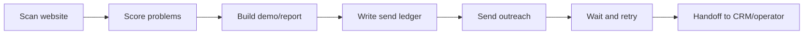

# Revenue Flow - What The City Is Built To Do

## Simple Picture

```mermaid
flowchart LR
  Traffic["Traffic: search, social, referrals, outbound lists"]
  Capture["Capture: forms, DMs, calls, email replies"]
  Research["Research: crawl site, enrich business, score opportunity"]
  Offer["Offer: audit, demo, CMA, automation, voice agent"]
  Delivery["Delivery: Vercel site, OpenClaw agent, email, report, call"]
  Followup["Follow-up: ledger, email sequence, CRM handoff"]
  Revenue["Revenue: setup fee, retainer, upsell, saved labor"]

  Traffic --> Capture
  Capture --> Research
  Research --> Offer
  Offer --> Delivery
  Delivery --> Followup
  Followup --> Revenue
  Revenue --> Followup
```

## Revenue Purpose By System Area

| System area | What it does | Revenue purpose |
| --- | --- | --- |
| OpenClaw gateway | Runs agents, tools, channels, and model routing | Turns one platform into many paid assistant deployments |
| Plugins | Add providers, channels, model access, and tools | Lets customer workflows be assembled faster |
| Control UI | Gives operators a dashboard | Saves support and ops time |
| Mobile apps | Gives on-the-go access to gateway sessions | Improves customer/operator experience |
| Tenant bootstrap | Creates tenant configs and runtime templates | Speeds up paid launch |
| Docker/Caddy/Hetzner | Runs tenant gateway services | Keeps operating cost predictable |
| Vercel apps | Host customer-facing sites and funnels outside this repo | Faster sales pages and safer product rollouts |
| Vercel AI Gateway | Routes model calls through one control point | Cost visibility, fallback, and model flexibility |
| Vercel Queues/Workflows | Run long lead/report/follow-up jobs reliably | Fewer lost leads and fewer manual retries |
| Supabase | Stores leads, tenants, ledgers, and state | Keeps revenue data durable and queryable |
| Firecrawl | Crawls websites for audits and lead research | Powers the website rescue offer |
| Resend/Microsoft Graph | Sends outreach and handles email workflows | Converts researched leads into sales conversations |
| Google Places/Gemini/OpenAI | Enrichment, analysis, generation, media, voice | Improves offer quality and automation depth |
| Julian rescue app lane | Self-running website rescue app | Direct lead-gen engine for local business offers |

## Julian Last State

Confirmed from repo docs:

- Julian's `rescue-websites` app was found in a fragile container writable layer.
- A host safety copy was made under a backed-up tenant path.
- The active branch was pushed to GitHub.
- Later docs report head `77cbb1f` with Maze deliverables and recovery docs pushed.
- Deliberate scratch files remained uncommitted.

Plain-English state:

Julian's work moved from "one fragile copy in a container" to "safe copies in GitHub, host backup, and original container." The next business decision is whether to commit any remaining real deliverables from the backup, not whether the core work is lost.

## Biggest Revenue Bottleneck

The system has many strong parts, but the road from lead research to reliable follow-up is not yet one clean road. It crosses:

- rescue code,
- Supabase tables,
- outbound email,
- provider APIs,
- Vercel-hosted storefronts,
- OpenClaw tenant gateways,
- and GitHub docs.

That means a lead can fall between systems.

## Highest-Leverage Fix

Build one durable rescue pipeline:

Use Supabase for the record book, Resend or Graph for delivery, and Vercel Queues/Workflows only inside actual Vercel-hosted app repos.
