# Visual Repo Map - State, City, Street, House, Room

Audit date: 2026-07-03

## State

State means the whole business machine.

**State: TAG AI Operating System**

This state contains the OpenClaw gateway, TAG overlay docs, tenant launch tools, app clients, provider plugins, lead systems, and recovery/audit records.

```mermaid
flowchart TD
  State["State: TAG AI Operating System"]

  GatewayCity["City: OpenClaw Gateway"]
  ProviderCity["City: Provider Equipment Yard"]
  TenantCity["City: Tenant Operations"]
  RevenueCity["City: Revenue Factories"]
  AppCity["City: Customer And Operator Apps"]
  SafetyCity["City: Docs And Safety Office"]

  State --> GatewayCity
  State --> ProviderCity
  State --> TenantCity
  State --> RevenueCity
  State --> AppCity
  State --> SafetyCity

  GatewayCity --> Src["Street: src/"]
  GatewayCity --> Packages["Street: packages/"]
  GatewayCity --> Scripts["Street: scripts/"]

  ProviderCity --> Extensions["Street: extensions/"]
  ProviderCity --> Mcp["Street: mcp-servers/"]
  ProviderCity --> Skills["Street: skills/"]

  TenantCity --> TagBootstrap["Street: _tagai/bootstrap/"]
  TenantCity --> TagDeploy["Street: _tagai/business-box/deploy/"]
  TenantCity --> Compose["Street: docker-compose and Caddy docs"]

  RevenueCity --> RescueSim["Street: rescue-websites-sim/"]
  RevenueCity --> RescuePatch["Street: _tagai/rescue-patch-2026-05-12/"]
  RevenueCity --> Julian["Street: _tagai/julian-rescue-websites-audit-2026-06-08/"]
  RevenueCity --> BusinessBox["Street: _tagai/business-box/"]

  AppCity --> UI["Street: ui/"]
  AppCity --> Android["Street: apps/android/"]
  AppCity --> IOS["Street: apps/ios/"]
  AppCity --> MacOS["Street: apps/macos/"]

  SafetyCity --> Docs["Street: docs/"]
  SafetyCity --> Agents["Street: AGENTS.md files"]
  SafetyCity --> AuditBundles["Street: _tagai/audit-*"]
```

## City 1: OpenClaw Gateway

What it is: city hall and traffic control.

Streets:

- `src/` - the main road network.
- `packages/` - shared building supplies.
- `scripts/` - maintenance vehicles.

Houses:

- Gateway runtime.
- Agent runtime.
- Sessions and memory.
- Channels.
- Plugin loader.
- CLI commands.
- Scheduler and task ledger.
- Security and secret handling.

Rooms:

- `src/gateway/` - WebSocket/RPC gateway rooms.
- `src/agents/` - the agent brain rooms.
- `src/channels/` - message transport rooms.
- `src/plugins/` - plugin loading rooms.
- `src/cron/` and `src/tasks/` - scheduled worker rooms.
- `src/secrets/` and `src/security/` - lockbox rooms.

Revenue purpose:

- Lets TAG build one assistant platform and reuse it for many customer workflows instead of rebuilding every bot from scratch.

## City 2: Provider Equipment Yard

What it is: the warehouse of outside equipment the agents can use.

Streets:

- `extensions/` - plugin street.
- `mcp-servers/` - external tool server street.
- `skills/` - reusable operator playbook street.

Houses:

- AI model providers.
- Messaging channels.
- Search and crawl tools.
- Voice and media tools.
- Browser and sandbox tools.
- Memory providers.
- Microsoft Graph MCP.

Rooms:

- `extensions/*/openclaw.plugin.json` - plugin ID cards.
- `extensions/firecrawl/` - web crawl and current dirty agent-tool work.
- `extensions/vercel-ai-gateway/` - Vercel AI Gateway provider plugin.
- `extensions/openai/`, `extensions/anthropic/`, `extensions/google/`, `extensions/deepseek/` - model rooms.
- `mcp-servers/microsoft-graph/src/index.mjs` - mail, calendar, and OneDrive tool room.

Revenue purpose:

- Gives agents hands. They can search, scrape, send, read, call APIs, create media, and operate business workflows.

## City 3: Tenant Operations

What it is: the construction crew for paid tenant deployments.

Streets:

- `_tagai/bootstrap/`
- `_tagai/business-box/deploy/`
- `_tagai/DEPLOY_HETZNER.md`
- `_tagai/CADDY_AUDIT.md`
- `_tagai/ECOSYSTEM.md`

Houses:

- Tenant bootstrap templates.
- Docker Compose overlay.
- Caddy routing notes.
- Hetzner runbooks.
- Paid-tenant preflight checks.

Rooms:

- `_tagai/bootstrap/_template/openclaw.json.tpl`
- `_tagai/bootstrap/_template/docker-compose.tenant.yml.tpl`
- `_tagai/business-box/deploy/preflight-paid-tenant.sh`
- `_tagai/.env.tagai.example`

Revenue purpose:

- Shortens the time from "customer paid" to "customer has a working assistant."

## City 4: Revenue Factories

What it is: the sales-production area.

Streets:

- `rescue-websites-sim/`
- `_tagai/rescue-patch-2026-05-12/`
- `_tagai/business-box/`
- `_tagai/julian-rescue-websites-audit-2026-06-08/`

Houses:

- Website rescue simulator.
- Supabase migration examples.
- Outreach email code.
- Business intake docs.
- Vertical offer templates.
- Julian recovery docs.

Rooms:

- `rescue-websites-sim/migrations/001-add-tenant-isolation.sql`
- `rescue-websites-sim/migrations/002-supabase-postgres-best-practices.sql`
- `_tagai/business-box/intake/*`
- `_tagai/business-box/verticals/construction/*`
- `_tagai/julian-rescue-websites-audit-2026-06-08/*`

Revenue purpose:

- Finds weak websites, creates audits or demos, follows up, and turns that into paid rescue work or monthly retainers.

## City 5: Customer And Operator Apps

What it is: the places people actually touch the system.

Streets:

- `ui/`
- `apps/android/`
- `apps/ios/`
- `apps/macos/`
- `apps/shared/`

Houses:

- Browser control UI.
- Android node app.
- iOS node app.
- macOS companion app.
- Shared mobile protocol/client code.

Rooms:

- `ui/src/`
- `ui/vite.config.ts`
- `apps/android/app/build.gradle.kts`
- `apps/ios/`
- `apps/shared/`

Revenue purpose:

- Makes the assistant usable by non-engineers and customers, which turns infrastructure into a sellable product.

## City 6: Docs And Safety Office

What it is: records, maps, warning signs, and operating rules.

Streets:

- `docs/`
- `AGENTS.md`
- `_tagai/audit-*`
- `CHANGELOG.md`
- `.github/`

Houses:

- Public OpenClaw docs.
- TAG private overlay docs.
- Repo operating rules.
- CI workflows.
- Release notes.

Rooms:

- `docs/AGENTS.md`
- `docs/start/*`
- `docs/tools/*`
- `docs/channels/*`
- `.github/workflows/*`
- `_tagai/audit-2026-07-03/*`

Revenue purpose:

- Reduces repeated mistakes, speeds handoffs, and protects customer trust.

## Agents And Workers

| Worker | Where found | What it does | Business outcome |
| --- | --- | --- | --- |
| Gateway worker | `src/gateway/` | Runs the central control plane | Keeps every assistant reachable |
| Agent runtime | `src/agents/` | Runs model turns with tools and sessions | Turns user requests into work |
| Cron worker | `src/cron/`, `docs/automation/cron-jobs.md` | Runs scheduled jobs | Follows up without manual reminders |
| Task ledger | `src/tasks/`, `docs/automation/tasks.md` | Records background work | Lets operators see what happened |
| Plugin loader | `src/plugins/`, `extensions/` | Loads provider equipment | Adds new capabilities faster |
| MCP server | `mcp-servers/microsoft-graph/` | Exposes mail/calendar/files | Automates admin and sales work |
| Control UI | `ui/` | Browser dashboard | Saves operator time |
| Mobile node apps | `apps/android/`, `apps/ios/` | Phone-based access and node features | Improves customer experience |
| Tenant bootstrap | `_tagai/bootstrap/` | Creates tenant setup files | Speeds paid deployments |
| Paid preflight | `_tagai/business-box/deploy/` | Checks launch readiness | Prevents broken customer launches |
| Rescue simulator | `rescue-websites-sim/` | Tests lead-pipeline risk without real sends | Protects sender reputation |
| Firecrawl agent tools | `extensions/firecrawl/` dirty worktree | Starts/status/cancels crawl-agent jobs | Potential lead research automation after review |

## Tool And Provider Groups

| Group | Examples found | What it is like in the city |
| --- | --- | --- |
| AI model providers | OpenAI, Anthropic, Google, DeepSeek, Groq, Mistral, OpenRouter, Bedrock, Cloudflare, Vercel AI Gateway | Power plants for agent brains |
| Messaging channels | Telegram, Slack, Discord, WhatsApp, Matrix, Teams, LINE, Signal, Twitch, Mattermost, Google Chat | Roads into the city |
| Search and crawl | Firecrawl, Brave, Exa, Tavily, SearXNG, DuckDuckGo, Perplexity | Research trucks |
| Voice and media | Deepgram, ElevenLabs, LiveKit, Twilio, Telnyx, fal, Runway, MiniMax | Phone booths and media studios |
| Data and state | Supabase, local files, SQLite/vector tooling, MCP config | Record books |
| Deployment | Docker, Caddy, Hetzner, Fly, Render, Vercel app repos | Buildings and utilities |
| Dev and quality | pnpm, Node, TypeScript, Vitest, tsdown, Vite, GitHub Actions | Inspectors and repair crews |
