# Revenue Flow - What This City Is Built To Do

Audit date: 2026-07-03

## Simple Picture

```mermaid
flowchart LR
  Traffic["Traffic: search, social, referrals, outbound lists"]
  Capture["Capture: forms, DMs, calls, email replies"]
  Research["Research: crawl site, enrich business, score opportunity"]
  Offer["Offer: audit, demo, CMA, automation, voice agent"]
  Delivery["Delivery: Vercel site, OpenClaw agent, email, report, call"]
  Ledger["Record book: Supabase, send ledger, task ledger"]
  Followup["Follow-up: sequence, CRM/operator handoff"]
  Revenue["Revenue: setup fee, retainer, upsell, saved labor"]

  Traffic --> Capture
  Capture --> Research
  Research --> Offer
  Offer --> Delivery
  Delivery --> Ledger
  Ledger --> Followup
  Followup --> Revenue
  Revenue --> Followup
```

## Revenue Purpose By System Area

| System area | What it does | Revenue purpose |
| --- | --- | --- |
| OpenClaw gateway | Runs agents, tools, channels, and sessions | Turns one platform into many paid assistant deployments |
| Provider plugins | Add models, messaging, search, voice, media, and tools | Lets TAG assemble customer workflows faster |
| Control UI | Gives operators a browser dashboard | Saves support and ops time |
| Mobile apps | Gives phone access to gateway/node features | Improves user experience |
| Tenant bootstrap | Creates tenant runtime templates | Speeds paid launches |
| Docker/Caddy/Hetzner | Runs tenant services | Keeps hosting cost predictable |
| Vercel app repos | Host customer-facing websites outside this repo | Faster sales pages and safer app rollouts |
| Vercel AI Gateway | Central model routing and visibility | Cost control and model fallback |
| Supabase | Durable lead, tenant, ledger, and app data | Keeps revenue data queryable and auditable |
| Firecrawl | Crawls and extracts websites | Powers website rescue audits |
| Resend/Microsoft Graph | Sends outreach and handles mail | Converts researched leads into conversations |
| Voice providers | Deepgram, ElevenLabs, LiveKit, Twilio, Telnyx | Turns assistant into voice/call workflows |
| Rescue websites lane | Finds weak websites and produces offers | Direct lead-generation engine |
| Julian tenant lane | Proof of a tenant/customer-like deployment | Template for future paid tenants |

## Julian Last State

Confirmed from existing repo docs:

- Julian's `rescue-websites` app was previously found in a fragile container writable layer.
- A host safety copy was made.
- Recovery docs say the active branch was pushed to GitHub.
- Existing July 2 audit says remaining uncommitted files were deliberate scratch or pending deliverables.
- A new untracked local folder exists now: `_tagai/julian-rescue-websites-audit-2026-06-08/`.

Plain-English state:

Julian's core work is not just sitting in one fragile place anymore. The repo says it was recovered and pushed. The remaining business decision is whether the new untracked Julian audit folder should be committed here, moved to a different repo, or archived.

## Biggest Revenue Bottleneck

The city has many tools, but the lead-to-revenue road is not yet one clean highway. It crosses:

- crawl providers,
- Supabase,
- outbound email,
- sender-domain reputation,
- Vercel storefronts,
- OpenClaw tenant gateways,
- task ledgers,
- and human follow-up.

If one bridge is missing, a lead can disappear.

## Highest-Leverage Revenue Build

Build one durable rescue pipeline:

Business rule: do not scale sending until tenant isolation, suppression lists, send ledgers, and sender-domain controls are proven.
