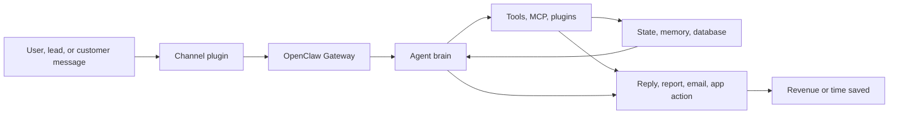

# Technical Architecture - Plain-English Stack Pipeline

Audit date: 2026-07-03

## Simple Stack Pipeline

This is the shortest version of the tech stack:

Plain-English analogy:

- The user enters the city through a road like Telegram, Slack, WhatsApp, web UI, or mobile.
- The Gateway is the traffic light.
- The Agent is the worker who decides what to do.
- Tools are equipment: browser, search, email, database, voice, media, MCP.
- Data is the city record book.
- Output is the finished work: answer, report, outreach, deployment step, or follow-up.
- Revenue is the reason the road exists.

## Runtime Stack

| Layer | Repo evidence | Plain-English meaning |
| --- | --- | --- |
| Runtime | `package.json` says Node `>=22.14.0`; local Node is `v22.14.0` | The city runs on Node |
| Language | TypeScript ESM, `"type": "module"` | The blueprints are typed JavaScript |
| Package manager | `pnpm-workspace.yaml`, `packageManager: pnpm@10.33.0`; local pnpm is `11.7.0` | One supply chain manager for the monorepo |
| Build | `tsdown.config.ts`, `pnpm build` | Packs the city for shipping |
| Test | Vitest scripts through `scripts/run-vitest.mjs` and `scripts/test-projects.mjs` | Inspectors that test rooms and streets |
| UI | `ui/` uses Vite and Lit | Browser dashboard |
| Mobile | `apps/android/`, `apps/ios/`, `apps/macos/` | Companion clients |
| Providers | `extensions/` plugin manifests | Equipment catalog |
| MCP | `@modelcontextprotocol/sdk`, `mcp-servers/microsoft-graph/` | Tool servers agents can call |
| Deployment | Docker, Caddy, Hetzner docs, Fly/Render configs | Where the city runs |

## Major Flows

### Flow 1: Chat Message To Agent Reply

1. A message arrives through a channel plugin.
2. Gateway identifies account, sender, session, and agent.
3. The selected agent loads its workspace, auth profiles, memory, model, and tools.
4. The agent calls tools as needed.
5. The reply is delivered back to the channel.

Revenue purpose:

- Customer support, operator automation, internal execution, and paid assistant service.

### Flow 2: Scheduled Work

1. A cron job is stored.
2. Scheduler wakes at the right time.
3. Gateway creates a task record.
4. Agent runs the work.
5. Output is delivered or queued.

Revenue purpose:

- Follow-up, monitoring, reporting, and reminders happen without a human babysitting them.

### Flow 3: Provider Plugin

1. A plugin manifest describes a provider.
2. Plugin loader validates and loads the plugin.
3. Tools/model/channel surfaces become available.
4. Agent can call those surfaces.

Revenue purpose:

- Adds new business capabilities without rewriting the core system.

### Flow 4: TAG Tenant Launch

1. Operator uses `_tagai/bootstrap/` templates.
2. Tenant config, workspace, Caddy routing, and Compose runtime are created.
3. Paid preflight checks launch readiness.
4. Customer gets a working assistant lane.

Revenue purpose:

- Turns "custom setup" into repeatable deployment.

### Flow 5: Rescue Website Revenue Lane

1. Find a business.
2. Crawl the website.
3. Score the problems.
4. Build a demo/report.
5. Write a send ledger.
6. Send outreach.
7. Follow up and hand off to CRM/operator.

Revenue purpose:

- Finds qualified local businesses and creates sales conversations.

## Main Gaps In The Pipeline

| Gap | Why it matters |
| --- | --- |
| Dirty Firecrawl provider work is not isolated | Provider behavior could be half-upgraded |
| Tokens were pasted into chat | Account keys may be compromised |
| Root repo is not a Vercel app | Vercel upgrades here are docs/provider prep, not actual app deployment |
| Rescue flow crosses many systems | Leads can fall between crawl, database, email, follow-up, and CRM |
| Tenant identity and mailbox boundaries need stricter proof | Wrong agent/mailbox can harm trust and compliance |
| Docs are spread across several audit folders | Operators may miss the latest map |
