# Visual Repo Map - State, City, Street, House, Room

Audit date: 2026-08-28

This explains the repo like a city. The point is simple: a business owner should see what exists, why it exists, how it makes money, and where the weak locks are.

```mermaid
flowchart TD
  State["State: TAG AI Business Operating System"]
  City["City: OpenClaw / Jarvis AI Gateway Repo"]

  Src["Street: src/ - city roads and traffic lights"]
  Extensions["Street: extensions/ - tool and provider district"]
  UI["Street: ui/ - web control room"]
  Apps["Street: apps/ - phone and desktop control rooms"]
  Packages["Street: packages/ - shared building materials"]
  Docs["Street: docs/ - public manuals"]
  Tagai["Street: _tagai/ - TAG business overlay"]
  Github["Street: .github/ - inspection gates and automation"]

  State --> City
  City --> Src
  City --> Extensions
  City --> UI
  City --> Apps
  City --> Packages
  City --> Docs
  City --> Tagai
  City --> Github

  Src --> Gateway["House: gateway"]
  Src --> Agents["House: agents"]
  Src --> Channels["House: channels"]
  Src --> Plugins["House: plugins"]
  Src --> Security["House: security and secrets"]
  Src --> Media["House: voice, media, search, memory"]

  Extensions --> LLMs["House: LLM providers"]
  Extensions --> Messaging["House: messaging providers"]
  Extensions --> Search["House: web search and crawl"]
  Extensions --> Voice["House: voice and audio"]
  Extensions --> Automation["House: MCP and tools"]

  Tagai --> VPS["House: Hetzner VPS runbooks"]
  Tagai --> Tenant["House: tenant bootstrap"]
  Tagai --> Revenue["House: business box and rescue pipeline"]
  Tagai --> Audit["House: audit bundles"]
```

## 1. State

**State: TAG AI Business Operating System**

This is the parent business machine. It includes customer assistants, lead capture, sales follow-up, web audits, voice agents, tenant onboarding, and the infrastructure that keeps those workers running.

Plain English: this is not "just code." It is the operating system for getting more work done with fewer manual steps.

## 2. City

**City: OpenClaw / Jarvis AI Gateway Repo**

The repo is the main city. It connects people, chat apps, AI models, tools, docs, and deployment scripts.

Plain English: if TAG is building AI workers, this repo is city hall plus the road system.

## 3. Streets

| Street | What lives there | Plain-English analogy | Revenue job |
| --- | --- | --- | --- |
| `src/` | Core TypeScript system | Main roads, traffic lights, and city hall offices | Makes one reusable engine for many customer workflows |
| `extensions/` | Provider plugins | Equipment district with phones, radios, search tools, and model engines | Adds sellable capabilities without rebuilding the city |
| `ui/` | Web UI | Control room | Lets operators use the system without living in terminals |
| `apps/` | Android, iOS, macOS apps | Mobile and desktop front desks | Lets customers and operators connect from real devices |
| `packages/` | Shared packages | Shared construction supplies | Prevents duplicate code and speeds delivery |
| `docs/` | Public OpenClaw docs | City manual and road signs | Reduces support burden and onboarding time |
| `_tagai/` | TAG-specific overlay | TAG private command center | Turns upstream OpenClaw into TAG's revenue machine |
| `.github/` | Workflows, labels, repo controls | Inspection booths | Keeps changes safer before they reach production |

## 4. Houses

### `src/` Houses

| House | Rooms | What it does |
| --- | --- | --- |
| Gateway | `src/gateway/`, `src/gateway/protocol/` | The front gate where clients connect over WebSocket/RPC. |
| Agents | `src/agents/`, `src/sessions/`, `src/tasks/` | The worker brains that receive a job, call tools, and return answers. |
| Channels | `src/channels/`, `src/auto-reply/` | Shared message rules for chat apps. |
| Plugins | `src/plugins/`, `src/plugin-sdk/` | Loads outside equipment safely through plugin contracts. |
| Secrets and Security | `src/secrets/`, `src/security/` | Lockbox rooms and inspection tools. |
| Memory and Context | `src/memory/`, `src/context-engine/` | The filing cabinet agents use to remember work. |
| Media | `src/tts/`, `src/realtime-voice/`, `src/image-generation/`, `src/video-generation/` | Voice, audio, image, and video work areas. |
| Search | `src/web-search/`, `src/web-fetch/`, `src/link-understanding/` | Research rooms for reading the web. |
| CLI | `src/cli/`, `src/commands/`, `openclaw.mjs` | The operator console. |

### `extensions/` Houses

| House | Example rooms | What it does |
| --- | --- | --- |
| LLM provider house | `extensions/openai/`, `extensions/deepseek/`, `extensions/anthropic/`, `extensions/google/`, `extensions/mistral/`, `extensions/openrouter/`, `extensions/groq/` | Lets OpenClaw talk to different AI model vendors. |
| Messaging house | `extensions/telegram/`, `extensions/discord/`, `extensions/slack/`, `extensions/whatsapp/`, `extensions/googlechat/`, `extensions/msteams/`, `extensions/mattermost/`, `extensions/matrix/`, `extensions/signal/`, `extensions/imessage/`, `extensions/zalo/` | Lets users message the assistant from normal chat tools. |
| Search and crawl house | `extensions/tavily/`, `extensions/exa/`, `extensions/brave/`, `extensions/firecrawl/`, `extensions/duckduckgo/` | Gives agents fresh research ability. |
| Voice and media house | `extensions/deepgram/`, `extensions/elevenlabs/`, `extensions/voice-call/`, `extensions/talk-voice/`, `extensions/runway/`, `extensions/fal/` | Gives the system voice, audio, image, and video equipment. |
| Automation house | `extensions/webhooks/`, `extensions/github-copilot/`, `extensions/browser/`, `extensions/phone-control/` | Lets agents trigger other workflows and interact with outside systems. |

### `_tagai/` Houses

| House | Rooms | What it does |
| --- | --- | --- |
| VPS operations | `_tagai/DEPLOY_HETZNER.md`, `_tagai/CADDY_AUDIT.md`, `_tagai/HEALTH.md`, `_tagai/SERVER_REPO_STATE.md` | Explains how the live server is built and operated. |
| Tenant bootstrap | `_tagai/bootstrap/` | Templates and scripts for spinning up new customer tenants. |
| Business box | `_tagai/business-box/` | Productized sales and delivery kit for vertical offers. |
| Backup scripts | `_tagai/scripts/backup.sh`, `_tagai/scripts/sync-to-github-split.sh` | Daily backup and off-host sync plan. |
| Audit archive | `_tagai/audit-*` | Historical maps and risk reports. |
| Live model config | `_tagai/LIVE_MODEL_CONFIG_2026-08-02.md` | Current known LLM routing for Gus and Julian containers. |

## 5. Rooms

Important rooms to know:

- `package.json`: names the app, CLI, package exports, scripts, and dependencies.
- `pnpm-workspace.yaml`: defines the monorepo workspaces and supply-chain delay rules.
- `AGENTS.md`: root operating rules for future coding agents.
- `docs/cli/security.md`: local source for OpenClaw security audit commands.
- `docs/cli/secrets.md`: local source for OpenClaw secrets audit commands.
- `_tagai/README.md`: front door for TAG overlay docs.
- `_tagai/audit-2026-08-28/*`: current enterprise audit package.

## 6. Agents And Workers

| Worker | Where it lives | What it does | Business value |
| --- | --- | --- | --- |
| OpenClaw Gateway | `src/gateway/` and Docker containers | Keeps the AI city online and reachable. | Turns one server into many AI assistant entry points. |
| Agent Runtime | `src/agents/` | Runs model turns, tools, sessions, and replies. | Automates work that would otherwise need a person. |
| Model Router | `src/model-catalog/`, provider extensions, live configs | Chooses primary and fallback LLMs. | Balances cost, quality, and uptime. |
| Plugin Loader | `src/plugins/`, `extensions/*` | Loads provider equipment. | Adds new services faster. |
| Channel Workers | `extensions/telegram/`, `extensions/discord/`, etc. | Move messages between chat apps and the gateway. | Lets customers use familiar channels. |
| Cron / Task Workers | `src/cron/`, `src/tasks/` | Runs scheduled jobs. | Creates follow-up without manual reminders. |
| Backup Cron | VPS crontab and `_tagai/scripts/*` | Saves runtime configs and memory snapshots. | Protects business continuity. |
| Healthcheck Cron | VPS crontab | Checks OpenClaw health every few minutes. | Reduces downtime blind spots. |
| Lane Jam Watchdog | VPS crontab | Watches for stuck work lanes. | Keeps automation from silently stalling. |
| Caddy | VPS service | Routes public HTTPS to local services. | Turns internal apps into customer-facing domains. |
| fail2ban | VPS service | Bans repeated bad SSH attempts. | Reduces brute-force risk. |
| GitHub Push Protection | GitHub repo setting | Blocks supported secrets before push. | Protects tokens and customer trust. |

## 7. Tools Being Used

| Tool type | Tools/providers |
| --- | --- |
| Runtime | Node.js 22, TypeScript ESM, pnpm workspaces |
| Build/test | tsdown, tsx, Vitest, oxlint, oxfmt, jscpd |
| Web/API framework | Hono, WebSocket, Undici, Zod, TypeBox, AJV |
| Infrastructure | Ubuntu 24.04, Hetzner VPS, Docker, Docker Compose, Caddy, UFW, fail2ban |
| AI model providers | OpenAI, DeepSeek, Anthropic, Google Gemini, Mistral, OpenRouter, Groq |
| Search/crawl | Tavily, Exa, Brave Search, Firecrawl, DuckDuckGo |
| Voice/audio | Deepgram, ElevenLabs, VAPI-adjacent webhook routes, LiveKit plans, Twilio plans |
| Messaging | Telegram, Discord, Slack, WhatsApp, Google Chat, Microsoft Teams, Mattermost, Matrix, Signal, iMessage, Zalo, and others |
| Data/memory | SQLite, sqlite-vec, Supabase/Postgres in TAG overlay plans |
| Email/payments | Resend, Stripe, Twilio where used by revenue workflows |
| Deployment/repo | GitHub, GitHub Actions, Vercel-adjacent docs, Hetzner server |

## 8. Outcomes And Objectives

The city was created to:

- Put AI workers behind normal chat apps.
- Give those workers tools like search, browser, voice, email, media, and memory.
- Reuse one platform for many customer tenants.
- Build lead machines like website rescue audits and vertical business boxes.
- Reduce manual operations through cron, healthchecks, and runbooks.
- Keep the upstream OpenClaw codebase clean while TAG customizations live in `_tagai/`.

## 9. Revenue Purpose

| City area | Revenue purpose |
| --- | --- |
| Gateway | Sell one reliable AI assistant platform many times. |
| Plugins | Add capabilities customers will pay for without rebuilding everything. |
| Messaging channels | Meet customers where they already communicate. |
| Voice | Creates higher-touch lead intake and customer support. |
| Search/crawl | Finds prospects, audits websites, and grounds reports in live facts. |
| Tenant bootstrap | Cuts delivery time after a customer pays. |
| Business box | Turns custom consulting into repeatable offers. |
| Backups and docs | Protect uptime, reduce mistakes, and make the business less dependent on one operator. |
