# Revenue Flow

Audit date: 2026-08-28

The repo should be judged by one business question: does this system create revenue, save time, or protect customer trust?

## Revenue Map

```mermaid
flowchart LR
  Prospect["Prospect has a problem"]
  Capture["Capture: website, chat, voice, outreach"]
  Diagnose["Diagnose: search, crawl, audit, score"]
  Package["Package: report, demo, offer"]
  Followup["Follow-up: email, SMS, chat, calendar"]
  Close["Close: payment, contract, onboarding"]
  Fulfill["Fulfill: tenant assistant and automation"]
  Retain["Retain: monitoring, reports, support"]

  Prospect --> Capture --> Diagnose --> Package --> Followup --> Close --> Fulfill --> Retain
```

## Area-By-Area Revenue Purpose

| Area | What it does | How it makes or protects money |
| --- | --- | --- |
| OpenClaw Gateway | Runs the central AI assistant system | Creates one reusable platform instead of a custom bot for every customer. |
| Model providers | Provide reasoning engines | Lets TAG choose cheaper, faster, or stronger AI depending on the job. |
| Search/crawl plugins | Pull fresh web facts | Creates lead lists, website audits, competitive research, and grounded reports. |
| Messaging plugins | Connect to Telegram, Discord, Slack, WhatsApp, Teams, and more | Lets customers interact where they already live, raising adoption. |
| Voice tools | Speech-to-text, text-to-speech, voice calls, webhook routes | Turns missed calls and inbound interest into captured conversations. |
| Tenant bootstrap | Templates and scripts for new customer setups | Shortens time from sale to delivery, improving cash conversion. |
| Business box | Reusable vertical offer kit | Turns one-off consulting into repeatable packages. |
| Backup/sync | Preserves configs and memory | Prevents lost work, downtime, and customer trust damage. |
| Security audits | Finds weak locks | Prevents account takeover, token abuse, and customer-data incidents. |
| GitHub docs | Creates a shared map | Makes handoffs faster and reduces duplicated effort. |

## Current Revenue Bottlenecks

| Bottleneck | Why it slows money |
| --- | --- |
| Secrets and tokens are not fully cleaned up | Customers and partners will not trust automation with exposed keys. |
| Tenant state is spread across repo docs, VPS folders, and chat | Delivery depends too much on memory instead of a repeatable checklist. |
| Production server has uncommitted drift | The team cannot reliably reproduce or roll back the live system. |
| Backups need restore proof | A backup is only business protection after a restore has been tested. |
| Model tier policy is unclear | Expensive jobs may use weak models, or cheap jobs may use costly models. |
| GitHub dependency automation is incomplete | Known vulnerable packages may sit longer than necessary. |
| Caddy/domain routes are inconsistent | Customer-facing domains look less mature and are harder to reason about. |

## Business Owner Translation

- The **gateway** is the front desk.
- The **agents** are employees.
- The **models** are the brains.
- The **plugins** are tools on the workbench.
- The **channels** are phones, radios, and inboxes.
- The **database/memory** is the filing cabinet.
- The **VPS** is the building.
- The **firewall/Caddy/SSH controls** are locks, guards, and front-door signs.
- The **revenue pipeline** is the road from a stranger with a problem to a paying customer.

Right now, the city works. The next job is to make it cleaner, safer, easier to operate, and easier to sell repeatedly.
