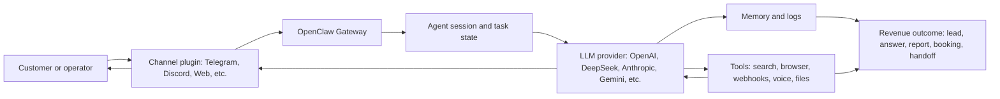
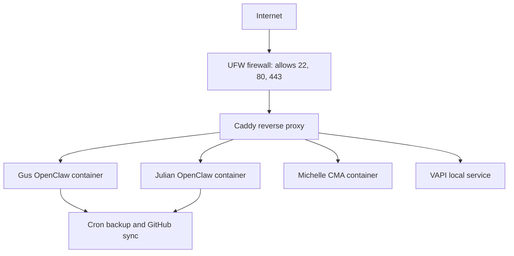

# Technical Architecture Pipeline

Audit date: 2026-08-28

This is the tech stack pipeline in plain English.

## One-Line Pipeline

User message -> channel plugin -> OpenClaw Gateway -> agent session -> model provider -> tools -> memory/logs -> reply back to the user.

## Tech Stack

| Layer | What is used | Plain-English job |
| --- | --- | --- |
| Language | TypeScript, JavaScript, Swift, Kotlin | The construction material used to build the city. |
| Runtime | Node.js 22 | The engine that runs the gateway and CLI. |
| Package manager | pnpm workspaces | The warehouse manager for all packages in the monorepo. |
| Backend | OpenClaw Gateway, Hono, WebSocket, CLI commands | The roads and dispatch center. |
| Plugin system | `src/plugin-sdk/`, `src/plugins/`, `extensions/*` | Lets new equipment plug into the city without rebuilding city hall. |
| AI providers | OpenAI, DeepSeek, Anthropic, Google Gemini, Mistral, OpenRouter, Groq | Model engines used by agents. |
| Channels | Telegram, Discord, Slack, WhatsApp, Google Chat, Teams, Mattermost, Matrix, Signal, iMessage, Zalo | Customer front doors. |
| Search | Tavily, Exa, Brave, Firecrawl, DuckDuckGo | Research trucks that collect fresh web facts. |
| Voice/media | Deepgram, ElevenLabs, VAPI routes, LiveKit/Twilio plans | Phone, speech, and media equipment. |
| Data/memory | SQLite, sqlite-vec, Supabase/Postgres plans | The filing cabinet and customer data warehouse. |
| Infra | Ubuntu, Hetzner VPS, Docker, Docker Compose, Caddy, UFW, fail2ban | The land, buildings, doors, and guards. |
| QA | Vitest, oxlint, oxfmt, tsgo lanes, `pnpm check:changed` | Inspectors that catch broken work. |
| Repo security | GitHub secret scanning, push protection, Dependabot status | Gate checks before code enters GitHub. |

## Live Model Pipeline

The live model state is documented in `_tagai/LIVE_MODEL_CONFIG_2026-08-02.md`. The current confirmed summary from live containers is:

| Tenant/container | Primary LLM | Fallbacks |
| --- | --- | --- |
| Gus/main OpenClaw | `openai/gpt-4o-mini` | `mistral/mistral-large-latest`, `mistral/codestral-latest`, `openrouter/auto` |
| Julian OpenClaw | `deepseek/deepseek-v4-pro` | `deepseek/deepseek-v4-flash`, `google/gemini-2.5-flash-lite`, `anthropic/claude-haiku-4-5`, `anthropic/claude-sonnet-4-6` |

Plain English: Gus is currently using a smaller OpenAI model as the first engine. Julian is using DeepSeek V4 Pro first, then cheaper/faster backup engines if needed.

## Runtime Pipeline On The VPS

Confirmed public exposure from outside the VPS:

| Port | Publicly reachable |
| --- | --- |
| 22 | Yes |
| 80 | Yes |
| 443 | Yes |
| 3000 | No |
| 8080 | No |
| 8081 | No |
| 8085 | No |
| 8086 | No |
| 18080 | No |
| 18081 | No |
| 18789 | No |
| 18790 | No |
| 18792 | No |
| 18884 | No |
| 19084 | No |
| 2019 | No |

This is good, but not perfect. Some internal services still bind to all interfaces. UFW is blocking them today, but A+++ architecture should bind private services to loopback too.

## Current Public Domain Behavior

| URL | Probe result | Risk note |
| --- | --- | --- |
| `https://openclaw.ubntag.com/healthz` | 200 with HSTS, nosniff, frame deny | Healthy, but header duplication should be cleaned. |
| `https://julian.ubntag.com/` | 200 with HSTS, nosniff, frame deny | Healthy, but header duplication should be cleaned. |
| `https://voiceai.ubntag.com/` | 200 with HSTS and frame deny, CORS `*` | Wildcard CORS needs explicit justification. |
| `http://87.99.148.242/` | 200 with no security headers, CORS `*` | Direct IP route should be removed unless actively needed. |
| `https://cma.ubntag.com/` | HEAD returned 404 | Needs route-specific health proof. |
| `https://brightsmile.ubntag.com/` | 200, no HSTS/nosniff/frame headers | Add response security headers. |
| `https://sterling.ubntag.com/` | 200, no HSTS/nosniff/frame headers | Add response security headers. |

## Current VPS Pipeline State

| Area | Confirmed state |
| --- | --- |
| Host | Ubuntu 24.04.3 LTS on Hetzner |
| Docker containers | Gus OpenClaw, Julian OpenClaw, Michelle CMA all healthy |
| Firewall | UFW active; public 22/80/443 only in outside scan |
| Reverse proxy | Caddy v2.11.2, config validates |
| Failed systemd units | 0 |
| Backups | Daily cron creates dated local folders; GitHub backup repo was pushed on 2026-08-28 |
| Package patching | 77 updates pending; 9 security updates |
| SSH | Password auth enabled; root login allowed with keys |
| Secrets | OpenClaw secrets audits still unresolved for Gus and Julian |

## Main Flow Outcomes

| Flow | Objective | Revenue value |
| --- | --- | --- |
| Chat message -> AI answer | Let a user talk to an assistant from chat | Faster support and higher customer engagement |
| Lead/research -> report | Find business problems and package them clearly | Creates sales conversations |
| Tenant bootstrap -> live assistant | Clone a repeatable customer setup | Shortens fulfillment time |
| Voice route -> assistant | Let customers talk by voice | Better intake and conversion |
| Backup -> restore | Keep business data recoverable | Prevents downtime and customer trust loss |
