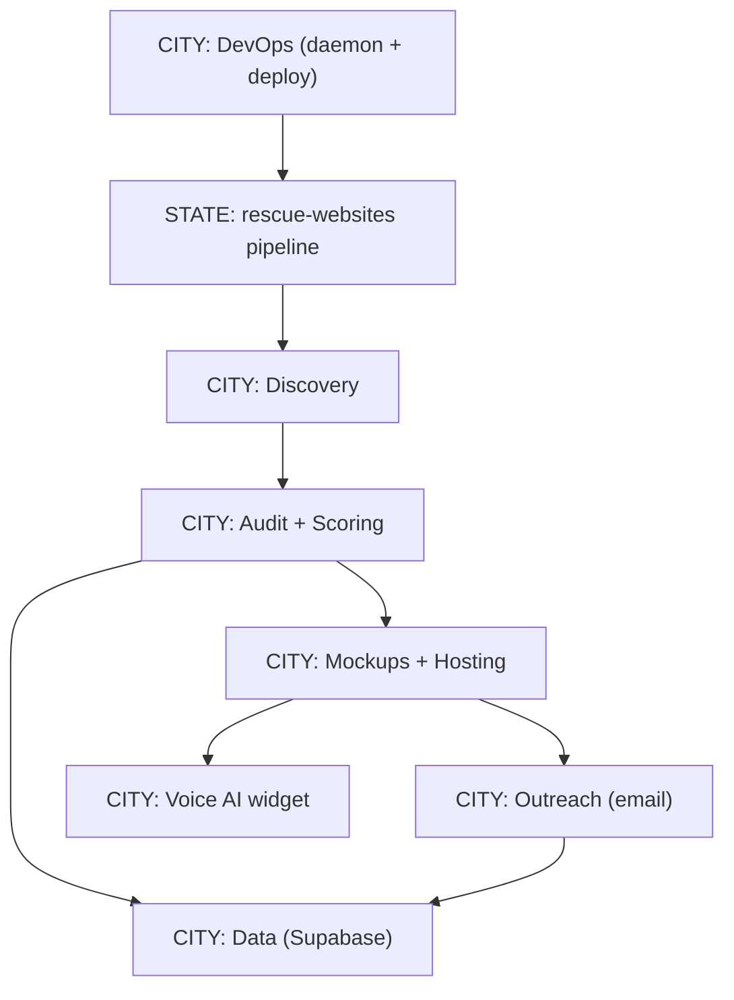
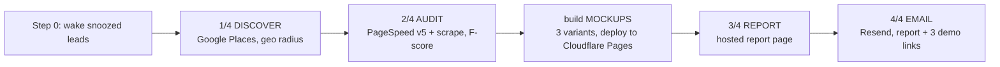

# Repo Visual Map — Julian rescue-websites — 2026-06-08

Plain-English picture of Julian's machine, using **State → City → Street → House → Room → Worker**. Read first-hand from the repo, not memory.

## What this machine does (one breath)
It finds local businesses with weak or no websites, **grades their current site (an F-score)**, builds them 3 free demo sites, hosts the demos live, and emails the owner a report plus the demo links. The pitch is "here's proof your site is failing, and here's what better looks like." It runs itself on a daily timer.

## The State (whole machine)
`rescue-websites` — a TypeScript (tsx) outbound-sales pipeline. Not a website itself; it's a **factory that produces website demos + outreach.**

## The pipeline (the main street) — `src/pipeline.ts`, runs `[1/4]`→`[4/4]`

## City breakdown

### City: Discovery — `src/discover/discover.ts`
- **What:** finds businesses by industry + location using Google Places (place types + text queries).
- **Revenue purpose:** fills the top of the funnel. No leads = no sales.
- **Workers/Utilities:** Google Places API (new + some legacy). **Verticals (code):** construction, landscaping, food-manufacturing, logistics, restaurants, education, healthcare, automotive.

### City: Audit + Scoring — `src/audit/audit.ts`, `scrape.ts`
- **What:** runs Google PageSpeed (Lighthouse) + scrapes the site, then scores it. `calcTechnicalScore` deducts for no SSL, no sitemap, no robots.txt, broken links, missing meta titles/descriptions/H1s/alt text. `calcPerformanceScore` uses PageSpeed.
- **Revenue purpose:** the **F-score is the hook.** "Your site scores 49/100" sells better than "you should have a website."
- **Utilities:** Firecrawl (v1 SDK), Google PageSpeed v5, Playwright.

### City: Mockups + Hosting — `src/audit/mockup.ts`, `template-engine.ts`, `src/lib/cloudflare.ts`
- **What:** generates 3 demo-site variants per business (Handlebars templates), deploys them live to **Cloudflare Pages**, returns shareable URLs.
- **Revenue purpose:** "try before you buy." Real, clickable demos beat a sales pitch.
- **Utilities:** Handlebars, Cloudflare Pages/Workers.

### City: Voice AI widget — `src/lib/voice-widget.ts`, `livekit-connector.ts`, `src/workers/voice-proxy.ts`
- **What:** embeds a talk-to-AI voice agent on every demo site, via LiveKit + a Cloudflare Worker proxy + Gemini.
- **Revenue purpose:** wow-factor; lets the prospect interact with "their" new site.

### City: Outreach — `src/outreach/email.ts`, `construction/*`
- **What:** extracts the owner email, sends the report + 3 demo links via Resend, respects `DAILY_SEND_CAP`.
- **Revenue purpose:** this is the actual ask. Reply = a deal in motion.
- **Utilities:** Resend (from a verified `ubntag.com` sender).

### City: Data — `src/lib/db.ts`, `supabase-schema.sql`
- **What:** Supabase stores leads, audit results, statuses (discovered → report_generated → snoozed → emailed). Drives the snooze/wake retry logic.
- **Revenue purpose:** the memory that prevents double-emailing and tracks the funnel.

### City: DevOps — `src/god-mode/daemon.ts`, `start.sh`
- **What:** a cron-style daemon (PID-based) that runs the whole pipeline daily.
- **Revenue purpose:** turns the machine into a **self-running lead engine** (no human needed per run).
- **Risk:** single daemon, single process — see RISK_REGISTER.

## Workers (things that run on their own)
| Worker | File | Job |
|---|---|---|
| God-mode daemon | `src/god-mode/daemon.ts` | runs the full pipeline daily |
| Voice proxy | `src/workers/voice-proxy.ts` | Cloudflare Worker bridging the demo widget to LiveKit/Gemini |
| Email-open caller | `src/workers/email-open-caller.ts` | reacts to email opens (follow-up signal) |
| Real-estate extension | `src/realestate/expired-listings.ts` | a second vertical: expired MLS listings |
