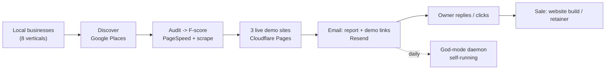

# Revenue Flow — Julian rescue-websites — 2026-06-08

How this code turns into money, where it leaks, and the single highest-leverage fix.

## The money road

## Where revenue starts
Cold. Julian's machine **manufactures** the lead and the pitch in one shot: it discovers a business, proves its site is failing (the F-score), and hands the owner a better version already built and hosted. The owner does nothing but look. That is a strong top-of-funnel because the value is shown, not described.

## Where it makes money (plain English)
- **Primary:** website builds / redesigns sold to businesses that got an F-score and saw a better demo.
- **Secondary vertical:** expired real-estate listings (`src/realestate/`) — same engine, different target.
- **Operational leverage:** the daemon runs it daily with no human, so the cost per lead trends toward just API spend.

## Where revenue leaks (highest-leverage first)

### Leak 1 — Shared sender domain (reputation risk)
`RESEND_FROM` defaults to `julian@ubntag.com`. Julian's cold outreach shares the **same sending domain** as Gus's E-Rate, Spectrum, and copper-send pipelines. One bad blast (spam complaints, bad list) can hurt deliverability for **every** TAG email pipeline at once. The `DAILY_SEND_CAP` (1000) helps, but the shared-domain blast radius is the real exposure.
- **Fix:** give Julian's cold outreach its **own subdomain** (e.g. `rescue@go.ubntag.com` or a separate domain) so a reputation hit is isolated. Highest leverage because it protects revenue across all of TAG, not just Julian.

### Leak 2 — Provider drift can silently kill the funnel
- **Firecrawl v1 SDK** and the **legacy Google Places** calls are both one breaking-change away from a quiet outage. If discovery or audit stops returning data, the funnel goes dry and the daemon keeps "running" while producing nothing.
- **Fix:** migrate Firecrawl to v2, confirm Places is all on the new API, and add a daemon health check that alerts when a run produces zero leads.

### Leak 3 — The Gemini/PageSpeed keys face Google's restriction deadline
Same class of issue that already bit the shared Gemini key. An unrestricted key can get auto-blocked. If the voice widget (Gemini) or audit (PageSpeed) key dies, the demo loses its wow-factor or the score fails.
- **Fix:** restrict both keys to their specific APIs before the deadline.

### Leak 4 — Single daemon, single box (continuity)
The whole engine is one PID-based daemon on one container. If it dies quietly (it crashed once this session), lead-gen stops and nobody is paged.
- **Fix:** a heartbeat/alert on the daemon, and a "0 leads today" alarm.

## The single most leveraged action
**Move Julian's cold outreach off the shared `ubntag.com` sending identity.** It is the one fix that protects revenue across the entire company, not just this pipeline. Everything else protects this one funnel; this protects all of them.

## Note (resolved this session)
The biggest *continuity* risk — Julian's code living only in an ephemeral container layer, unpushed — was fixed today: his work is now on GitHub plus a host backup. See `../audit-2026-06-08/JULIAN_WORK_RECOVERY.md`.
