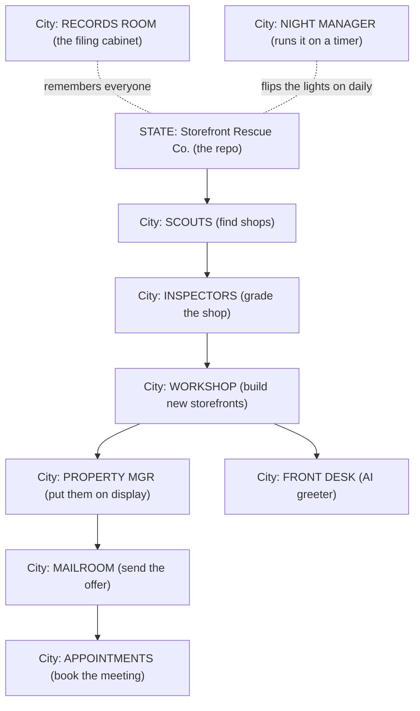
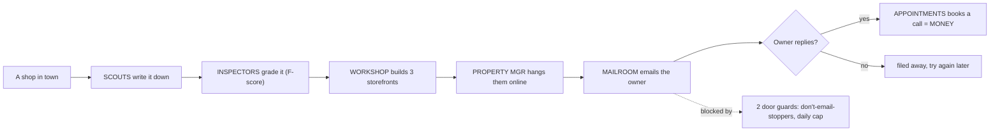
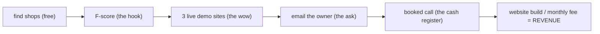

# Rescue-Websites — The Whole Repo as a Town (8th-grade map)

**Read me first.** Everything below is checked against the real code and the **live database** (1,445 real rows) and every outside tool was checked against its **current official docs** on 2026-06-08. Nothing here is a guess. Where the machine is only "built but not running yet," it says so.

---

## The one-breath version
Imagine a company called **Storefront Rescue Co.** It drives around town, finds shops with ugly or broken storefronts, **secretly builds each one a beautiful new storefront**, snaps a "before and after" photo, and mails the owner a note: *"Here's what your shop could look like. Want it?"* The whole company runs on a timer, mostly by itself. **This repo is that company, but for websites.**

---

## THE STATE — the whole company

---

## THE CITIES (departments) — what each one does, who works there, what tool it uses, how it makes money

### City 1 — SCOUTS · find shops
- **Plain English:** drives a chosen part of town and writes down every business of a certain type (like "all the construction companies near here").
- **House (folder):** `src/discover/` · **Room (function):** `discoverBusinesses()`
- **Tool (utility):** **Google Places** (the town's phone book). *Validated: works, but the code mixes the new phone book with an old one Google is closing — fix that.*
- **Money road:** fills the top of the funnel. No shops found = no sales. Think of scouts as the people who fill the leads jar.

### City 2 — INSPECTORS · grade the shop
- **Plain English:** looks at the shop's current website and gives it a report card, like **"F, 49 out of 100."** A bad grade is the hook — "your sign is falling down" sells better than "you should get a sign."
- **House:** `src/audit/` · **Rooms:** `auditWebsite()`, `calcTechnicalScore()` (docks points for no lock icon, broken links, missing titles), PageSpeed for speed.
- **Tools:** **Firecrawl** (a robot that reads the website) + **Google PageSpeed** (a stopwatch for how fast it loads) + **Playwright** (a robot that takes pictures). *Firecrawl is one version behind — worth upgrading.*
- **Money road:** the F-grade is the **reason the owner listens.** This is the most important sales tool in the building.

### City 3 — WORKSHOP · build the new storefront
- **Plain English:** builds **3 different beautiful versions** of a new website for that shop, so the owner gets to pick a favorite.
- **House:** `src/audit/mockup.ts`, `template-engine.ts` · **Tool:** **Handlebars** (a cookie-cutter for web pages).
- **Money road:** "try before you buy." Three real options beat a sales pitch.

### City 4 — PROPERTY MANAGER · put them on display
- **Plain English:** hangs the 3 new storefronts on the internet so the owner can actually click and walk through them.
- **House:** `src/lib/cloudflare.ts` · **Tool:** **Cloudflare Pages** (free billboards on the internet).
- **Money road:** a live, clickable demo is the thing that makes an owner say "wow."

### City 5 — FRONT DESK · the AI greeter
- **Plain English:** every demo storefront has a **friendly clerk you can talk to** (by text or voice). "Hi, want to know what we'd change about your site?"
- **House:** `src/lib/voice-widget.ts`, `src/workers/voice-proxy.ts` · **Tools:** **LiveKit** (the phone line) + **Google Gemini** (the clerk's brain).
- **⚠️ Reality:** the clerk's brain is wired to the **wrong name tag.** The code calls `gemini-3.1-flash`, but the live voice line needs `gemini-3.1-flash-live-preview`. So the voice clerk is probably **mute right now** (the logs show no real voice visitors since June 3).
- **Money road:** the "talk to your new site" wow-factor. When it works.

### City 6 — MAILROOM · send the offer
- **Plain English:** finds the owner's email and mails them the report card + the 3 new storefronts + an offer.
- **House:** `src/outreach/` · **Tool:** **Resend** (the post office). *Validated: can attach files and stamp each letter with a "do not send twice" sticker (idempotency key).*
- **Two safety guards on the door:** (1) **don't email people who said stop** (suppression list), (2) **don't mail too many in one day** (daily cap) so you don't get flagged as junk mail.
- **Money road:** this is the actual ask. A reply = a deal starting.

### City 7 — APPOINTMENTS · book the meeting
- **Plain English:** if the owner says "yes, let's talk," this books a real meeting on the calendar and sends a Teams link.
- **House:** `website_rescue_bookings` table · **Tools:** **Microsoft Graph** (the calendar) + **Teams** (the meeting room) + Resend (the confirmation).
- **Money road:** this is the **cash register** — where interest turns into a booked sales call.

### City 8 — RECORDS ROOM · the filing cabinet
- **Plain English:** remembers every shop, its grade, whether it was emailed, and what stage it's at — so nobody gets emailed twice and nothing falls through the cracks.
- **House:** `src/lib/db.ts` + the `website_rescue_*` tables · **Tool:** **Supabase** (the filing cabinet).
- **Money road:** the memory that keeps the whole operation honest and repeatable.

### City 9 — NIGHT MANAGER · runs it on a timer
- **Plain English:** a worker who shows up every day and runs the whole company start-to-finish with no human needed.
- **House:** `src/god-mode/daemon.ts` · **Money road:** turns the company into a **machine that runs while you sleep.**

---

## THE STREETS — the path one shop walks through town

---

## THE TOOLS (utilities) — all 9, checked against today's docs
| Tool | What it is (analogy) | Status today |
|---|---|---|
| Google Places | the town phone book | ✅ current; stop using the old phone book it still calls |
| Firecrawl | robot that reads websites | ✅ works; one version behind (v1, v2 is out) |
| Google PageSpeed | a stopwatch for websites | ✅ current |
| Playwright | robot photographer | ✅ current |
| Handlebars | cookie-cutter for web pages | ✅ fine |
| Cloudflare | free internet billboards | ✅ fine |
| Resend | the post office | ✅ current; can attach files |
| Microsoft Graph + Teams | calendar + meeting room | built, never used yet |
| LiveKit + Gemini | phone line + AI brain | ⚠️ Gemini wired to wrong name tag (voice likely broken) |
| Supabase | the filing cabinet | ✅ current; needs the master key for some writes (see below) |

---

## MONEY ROADS — how the money actually flows

**Where money starts:** the F-score hook. **Where it turns into cash:** a booked call. **Biggest leak:** see below.

---

## REALITY CHECK — what is actually running (live numbers, not theory)
The filing cabinet holds **1,445 real shops** — but the company is mostly **idling**, not selling yet:

| Thing | Live count | Plain meaning |
|---|---|---|
| Shops on file | **1,445** (all have a website) | big pile of leads ready |
| Shops with an owner email | **~30** | **the funnel is choked here** — can't mail 1,415 of them |
| Shops graded | ~75 (5%) | most haven't been inspected yet |
| Emails sent | 40 (37 to the owner's own inbox) | this was **testing**, not a real campaign |
| Bookings, chats, events | **0** | the cash register and greeter have **never rung** |
| Daily-cap counter | **0** (silently broken) | the "don't send too many" guard **doesn't actually work** |
| Unsubscribe list | **0** (nothing feeds it) | no working "stop emailing me" safety |

**The three honest truths:**
1. **The bottleneck is owner emails, not finding shops.** You have 1,272 ungraded shops with websites but almost no emails. The fix is **finding emails**, not finding more shops.
2. **The safety brakes are broken.** The daily cap can't count (it needs Supabase's *master key* to write, and it's using the *guest key*), and the stop-list is empty. So a real campaign today would have **no brakes** on the shared `ubntag.com` mail address that your paying campaigns also use.
3. **The fancy parts (voice clerk, bookings) are built but never used** — and the voice clerk is wired to the wrong Gemini name tag.

---

## THE OBJECTIVE — why this company exists
To turn **"this local business has a weak website"** into **"this local business just booked a call to fix it,"** automatically, at the cost of just some API fees, so one person can run a lead engine that normally needs a sales team.

## The single most valuable next move
**Fix the brakes and find the emails before flipping it on.** Specifically: (1) get owner emails for the 1,272 graded-but-unmailable shops, (2) give Supabase its master key so the daily cap and stop-list actually work, (3) move cold mail off the shared `ubntag.com` address. Then the 3-input-mode upgrade you want is safe to ship.

---
*Validated 2026-06-08 against live code, the live Supabase database (project bjhjqegqfieyekbffgij), and current provider docs (Firecrawl, Google Places, Resend, Supabase, LiveKit, Gemini). See `PROVIDER_VALIDATION.md` and `RISK_REGISTER.md` for the technical detail.*
